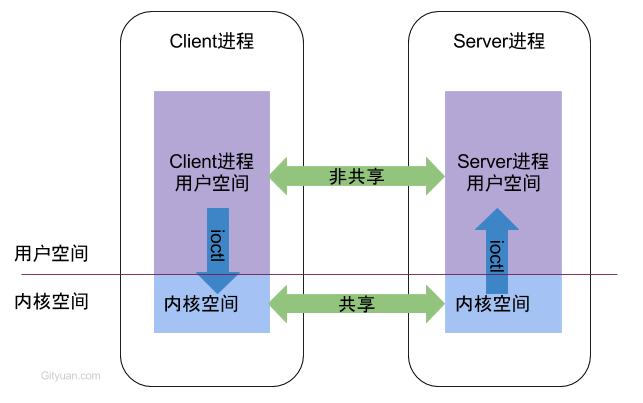

Binder机制内容太多太复杂，这里只记录一些碰到过的问题。

# Binder概述

Android系统中，每个应用程序是由Android的`Activity`，`Service`，`Broadcast`，`ContentProvider`这四剑客的中一个或多个组合而成，这四剑客所涉及的多进程间的通信底层都是依赖于Binder IPC机制。例如当进程A中的Activity要向进程B中的Service通信，这便需要依赖于Binder IPC。不仅于此，整个Android系统架构中，大量采用了Binder机制作为IPC（进程间通信）方案，当然也存在部分其他的IPC方式，比如Zygote通信便是采用socket。

从进程角度来看IPC机制，每个Android的进程，只能运行在自己进程所拥有的虚拟地址空间。对应一个4GB的虚拟地址空间，其中3GB是用户空间，1GB是内核空间，当然内核空间的大小是可以通过参数配置调整的。对于用户空间，不同进程之间彼此是不能共享的，而内核空间却是可共享的。Client进程向Server进程通信，恰恰是利用进程间可共享的内核内存空间来完成底层通信工作的。



Binder的分层架构：


# Binder 为什么高效

传统 IPC 传输数据：发送进程需要`copy_from_user`从用户到内核，接收进程再`copy_to_uer`从内核到用户，两次拷贝。

而 Binder 传输数据：用 mmap 将 binder **内核空间**的虚拟内存和**用户空间**的虚拟内存**映射到同一块物理内存**。`copy_from_user`将数据从**发送进程的用户空间**拷贝到**接收进程的内核空间**（一次拷贝），接收进程通过映射关系能直接**在用户空间读取内核空间的数据**。


# 权限控制检测

Android系统源代码经常看到`Binder.clearCallingIdentity()`和`Binder.restoreCallingIdentity()`这两个方法，其定义在`Binder.java`文件：

```java
//作用是清空远程调用端的uid和pid，用当前本地进程的uid和pid替代；
public static final native long clearCallingIdentity();
//作用是恢复远程调用端的uid和pid信息，正好是`clearCallingIdentity`的反过程;
public static final native void restoreCallingIdentity(long token);
```

这两个方法涉及的uid和pid，每个线程都有自己独一无二的`IPCThreadState`对象，记录当前线程的pid和uid，可通过方法`Binder.getCallingPid()`和`Binder.getCallingUid()`获取相应的pid和uid。

从定义这两个方法是native方法，在`android_util_Binder.cpp`文件中定义了native方法所对应的jni方法。

### 场景分析

首先线程A通过Binder远程调用线程B，然后线程B通过Binder调用当前线程的另一个service或者activity之类的组件。

**分析：**

1. 线程A通过Binder远程调用线程B：则线程B的IPCThreadState中的`mCallingUid`和`mCallingPid`保存的就是线程A的UID和PID。这时在线程B中调用`Binder.getCallingPid()`和`Binder.getCallingUid()`方法便可获取线程A的UID和PID，然后利用UID和PID进行权限比对，判断线程A是否有权限调用线程B的某个方法。
2. 线程B通过Binder调用当前线程的某个组件：此时线程B是线程B某个组件的调用端，则`mCallingUid`和`mCallingPid`应该保存当前线程B的PID和UID，故需要调用`clearCallingIdentity()`方法完成这个功能。当线程B调用完某个组件，由于线程B仍然处于线程A的被调用端，因此`mCallingUid`和`mCallingPid`需要恢复成线程A的UID和PID，这是调用`restoreCallingIdentity()`即可完成。


# Parcel数据容器

Android Binder进行跨进程IPC通信时，通常都是先将数据打包在Parcel对象中，然后通过Binder驱动进行传递。

Parcel从存储角度来说，Parcel是内存中的结构的是一块连续的内存，会根据需要自动扩展大小(当然这个是设计者实现的)。

一个简单例子：

```java

            Parcel data = Parcel.obtain();
            Parcel reply = Parcel.obtain();

            Log.d("TAG", "--- 客户端 , pid = "
                  + Process.myPid() + ", thread = "
                  + Thread.currentThread().getName());

            String str = "666";
            //2. 往data写数据，作为请求参数
            data.writeString(str);

            //3. 拿到服务端的IBinder句柄，调用transact
            //约定行为码是1；需要服务端的返回值，所以flags传0表示同步调用
            service.transact(1, data, reply, 0);

            //4. 从reply读取服务端的返回值
            Log.d("TAG", "服务端返回：" + reply.readString());
```

service.transact 传入了 flags 为`0`，表示**同步调用**，会**阻塞等待**服务端的返回值。如果服务端进行了耗时操作，此时用户操作 UI 则会引起 ANR。

flags 的另一个值是`1`，表示**异步调用的 one way**，**不需要等待服务端的返回结果**，先忽略。

Binder 机制使用了 **Parcel 来序列化数据**，客户端在主线程调用了 **transact 来请求**（Parcel data 传参），服务端在 **Binder 线程**调用**onTransact 来响应**（Parcel reply 回传结果）。