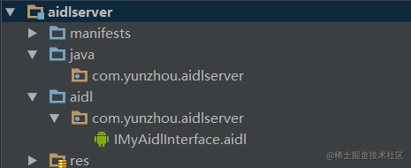
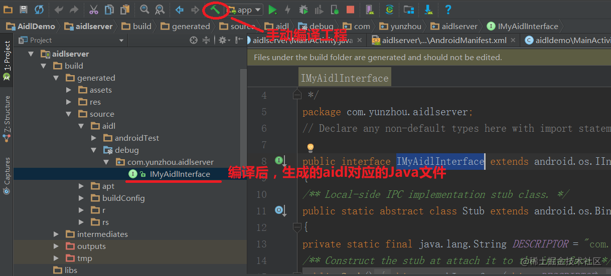
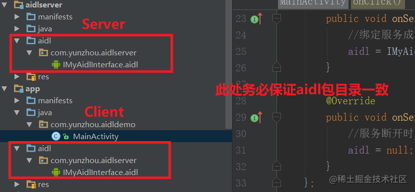

在Android中，系统会为每个进程分配对应的内存空间，这部分内存是彼此间相互独立，不可直接交互的，这样的设计是处于安全性以及系统稳定性方面考虑的，比如当我们的App奔溃时，不至于导致其他App无法运行，甚至死机等情况。

# AIDL

AIDL(Android Interface Define Language)是一种IPC通信方式，我们可以利用它来定义两个进程相互通信的接口。他是基于Service实现的一种线程间通信机制。它的本质是C/S架构的，需要一个服务器端，一个客户端。

## 使用

创建aild目录， 同时创建一个aidl文件



```java
// IMyAidlInterface.aidl
package com.yunzhou.aidlserver;

// Declare any non-default types here with import statements

interface IMyAidlInterface {

    /**
    * 自己添加的方法
    */
    int add(int value1, int value2);
}
```

这边可以看到aidl的语法跟JAVA是一样的，声明了一个接口，里面定义了aidl服务器端暴露给客户端调用的方法。完成这部分操作之后还没有结束，我们需要手动编译程序，生成aidl对应的Java代码



实现接口，并向客户端放开接口：

```java
public class MyAidlService extends Service {
    public MyAidlService() {
    }

    @Override
    public IBinder onBind(Intent intent) {
        return iBinder;
    }

    private IBinder iBinder = new IMyAidlInterface.Stub(){
        @Override
        public int add(int value1, int value2) throws RemoteException {
            return value1 + value2;
        }
    };
}
```

我们创建了一个service，并在service内部声明了一个IBinder对象，它是一个匿名实现的IMyAidlInterface.Stub的实例(这部分我们后面讲)，同时我们在发现IMyAidlInterface.Stub实例实现了add方法，这个方法正是我们在aidl中声明的供客户端调用的方法。

首先在客户端跟服务器一样，新建aidl目录，将服务器端的aidl拷贝到客户端，**这边特别要注意，拷贝后的客户端的aidl文件包目录必须与服务器端保持一致**，拷贝完后同样时编译工程，让客户端也生成对应的java文件



在Activity的onCreate中绑定服务：

```java
private ServiceConnection connection = new ServiceConnection() {
       @Override
       public void onServiceConnected(ComponentName name, IBinder service) {
           //绑定服务成功回调
           aidl = IMyAidlInterface.Stub.asInterface(service);
       }

       @Override
       public void onServiceDisconnected(ComponentName name) {
           //服务断开时回调
           aidl = null;
       }
   };

@Override
protected void onCreate(Bundle savedInstanceState) {
      super.onCreate(savedInstanceState);
      //do something
      bindService();
}

private void bindService(){
        Intent intent = new Intent();
        //Android 5.0开始，启动服务必须使用显示的，不能用隐式的
        intent.setComponent(new ComponentName("com.yunzhou.aidlserver", "com.yunzhou.aidlserver.MyAidlService"));
        bindService(intent, connection, Context.BIND_AUTO_CREATE);
    }
```

## AIDL参数类型

1. **基本数据类型支持：byte,char,int,long,float,double,boolean**

2. 可以使用String,CharSequence,List,Map

3. 自定义数据类型，用于进程间通信的话，必须实现Parcelable接口，Parcelable是类似于Java中的Serializable，Android中定义了Parcelable，用于进程间数据传递，对传输数据进行分解，编组的工作，相对于Serializable，他对于进程间通信更加高效。

我们定义一个User类，实现了Parcelable接口，需要注意的一点是，Parcelable对数据进行分解/编组的时候必须使用相同的顺序，字段以什么顺序分解的，编组时就以什么顺序读取数据，不然会有问题！

创建完实体后，我们需要创建一个aidl文件，来定义一下我们的User，否则User在aidl中无法识别。

```java
// IMyAidlInterface.aidl
package com.yunzhou.aidlserver;

parcelable User;
```

 并在之前的服务器端aidl中新增方法

```java
interface IMyAidlInterface {
    int add(int value1, int value2);
    List<User> addUser(in User user);
}
```

服务器端一切准备就绪后，我们对客户端进行操作，首先，我们将服务端的两个aidl文件复制到客户端，包结构必须一致，**aidl文件发生变化不要忘记重新编译代码**。