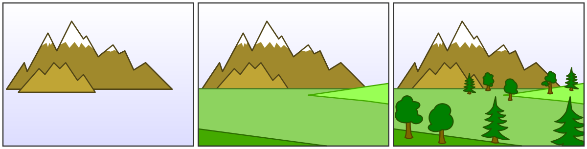
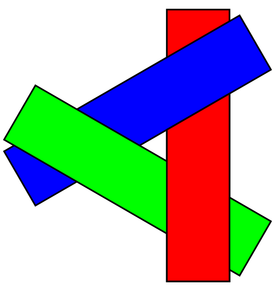

# Painter's algorithm 画家算法

理解Android过度绘制的基础，参考：

> https://en.wikipedia.org/wiki/Painter%27s_algorithm

计算机在绘制在很多情况下都是基于这个算法工作的：显示图像时逐个多边形绘制，而不是逐个像素、逐行或逐个区域地工作。画家算法通过按深度对图像中的多边形进行排序并按从最远到最近的对象的顺序放置每个多边形来创建图像。

以下图为例：

  

山处于图像的最底层，优先绘制，其次是草地，最后是树木。

缺点：

1. 不可见的也会被绘制。
2. 该算法在某些情况下可能会失败，包括循环重叠或刺穿多边形，例如：

  