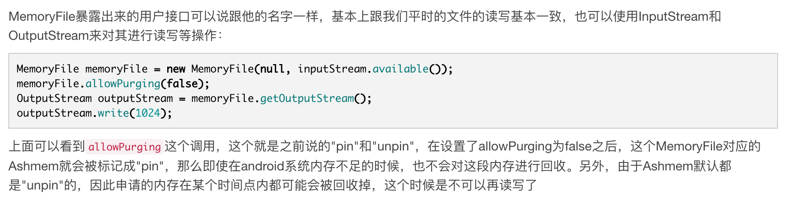

# What is it

MemoryFile是android在最开始就引入的一套框架，其内部实际上是封装了android特有的内存共享机制Ashmem匿名共享内存，简单来说，Ashmem在Android内核中是被注册成一个特殊的字符设备，Ashmem驱动通过在内核的一个自定义slab缓冲区中初始化一段内存区域，然后通过mmap把申请的内存映射到用户的进程空间中（通过tmpfs），这样子就可以在用户进程中使用这里申请的内存了，另外，Ashmem的一个特性就是可以在系统内存不足的时候，回收掉被标记为"unpin"的内存，这个后面会讲到，另外，MemoryFile也可以通过Binder跨进程调用来让两个进程共享一段内存区域。由于整个申请内存的过程并不再Java层上，可以很明显的看出使用MemoryFile申请的内存实际上是并不会占用Java堆内存的。

MemoryFile暴露出来的用户接口可以说跟他的名字一样，基本上跟我们平时的文件的读写基本一致，也可以使用InputStream和OutputStream来对其进行读写等操作：

> MemoryFile匿名共享内存简单案例https://blog.csdn.net/qq_24451593/article/details/80514566

# 共享内存

共享内存是进程间通信的一种方式，通过映射一块公共内存到各自的进程空间来达到共享内存的目的。

对于进程间需要传递大量数据的场景下，这种通信方式是十分高效的，但是共享内存并未提供同步机制，也就是说，在第一个进程结束对共享内存的写操作之前，并无自动机制可以阻止第二个进程开始对它进行读取，所以我们通常需要用其他的机制来同步对共享内存的访问，例如信号量。

`Android`中的匿名共享内存(Ashmem)是基于`Linux`共享内存的，借助`Binder`+文件描述符(`FileDescriptor`)实现了共享内存的传递。它可以让多个进程操作同一块内存区域，并且除了物理内存限制，没有其他大小限制。相对于`Linux`的共享内存，Ashmem对内存的管理更加精细化，并且添加了互斥锁。`Java`层在使用时需要用到`MemoryFile`，它封装了`native`代码。`Android`平台上共享内存通常的做法如下：

- 进程A通过`MemoryFile`创建共享内存，得到fd(`FileDescriptor`)
- 进程A通过fd将数据写入共享内存
- 进程A将fd封装成实现`Parcelable`接口的`ParcelFileDescriptor`对象，通过`Binder`将`ParcelFileDescriptor`对象发送给进程B
- 进程B获从`ParcelFileDescriptor`对象中获取fd，从fd中读取数据

- FilreDescriptor可以通过Parcel直接传也可以先定义AIDL接口

> https://androidrepo.com/repo/kongpf8848-aidldemo-android-network