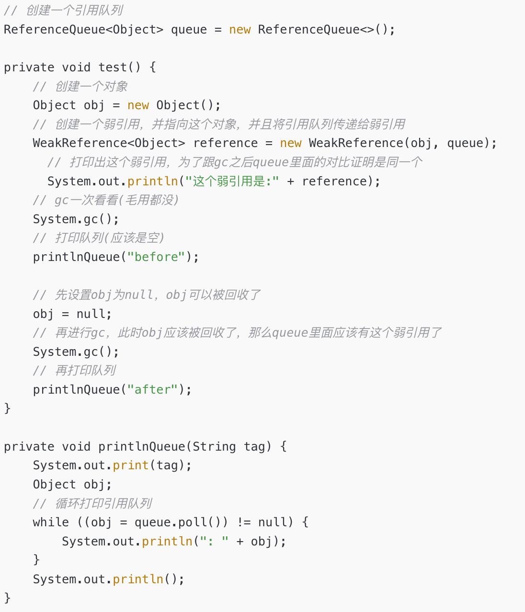
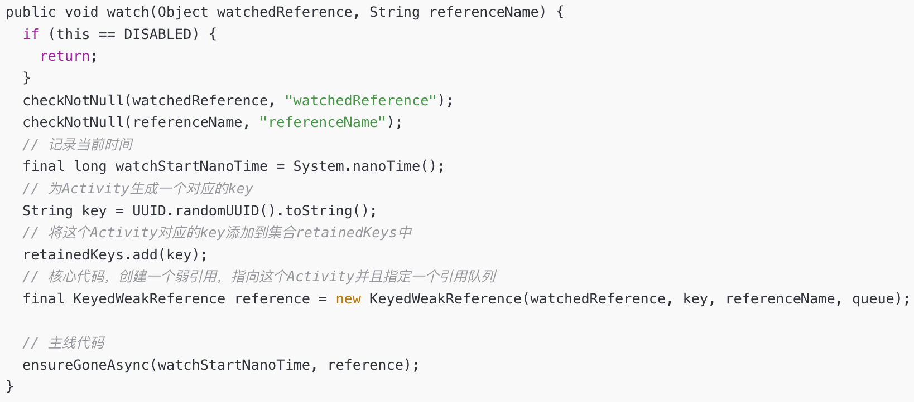
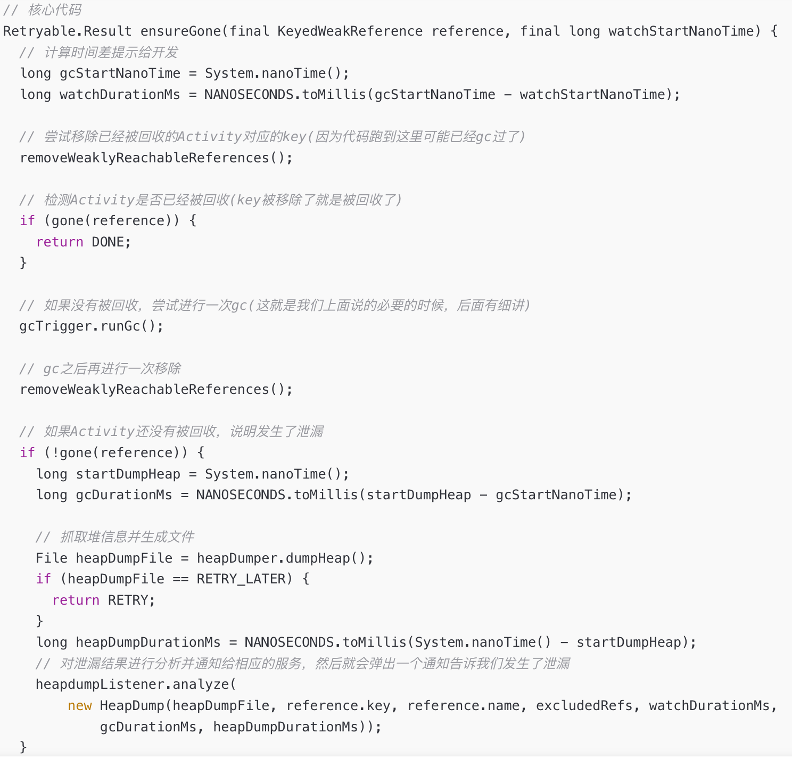
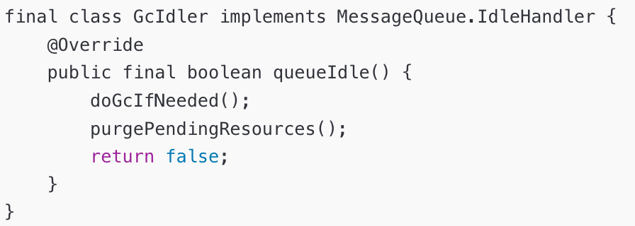

# 内存泄漏

内存泄漏(Memory Leak)是指程序中已动态分配的堆内存由于某种原因程序未释放或无法释放，造成系统内存的浪费，导致程序运行速度减慢甚至系统崩溃等严重后果。

Android为不同类型的进程分配了不同的内存使用上限，如果程序在运行过程中出现了内存泄漏的而造成应用进程使用的内存超过了这个上限，则会被系统视为内存泄漏，从而被kill掉，这使得仅仅自己的进程被kill掉，而不会影响其他进程(如果是system_process等系统进程出问题的话，则会引起系统重启)。

gc回收频繁（是危害也是特征），应用卡顿ANR。

常见原因：

- 忘记释放分配的内存;
- 应用不需要这个对象了，但是却没有释放这个对象的引用;
- 强引用持有的对象，垃圾回收器是无法回收这个对象;
- 持有对象生命周期过长，导致无法回收;

# 单例导致内存泄露

单例的静态特性使得它的生命周期同应用的生命周期一样长，如果一个对象已经没有用处了，但是单例还持有它的引用，那么在整个应用程序的生命周期它都不能正常被回收，从而导致内存泄露。

```java
public class AppSettings { 
    private static volatile AppSettings singleton; 
    private Context mContext; 
    private AppSettings(Context context) { 
        this.mContext = context; 
    } 
    public static AppSettings getInstance(Context context) { 
        if (singleton == null) { 
            synchronized (AppSettings.class) { 
                if (singleton == null) { 
                    singleton = new AppSettings(context); 
                } 
            } 
        } 
        return singleton; 
    } 
} 
```

为了避免这样单例导致内存泄露，我们可以将context参数改为全局的上下文：

```java
private AppSettings(Context context) { 
        this.mContext = context.getApplicationContext(); 
} 
```

# **静态变量导致内存泄漏**

静态持有很多时候都有可能因为其使用的生命周期不一致而导致内存泄露，所以我们在新建静态持有的变量的时候需要多考虑一下各个成员之间的引用关系，并且尽量少地使用静态持有的变量，以避免发生内存泄露。当然，我们也可以在适当的时候讲静态量重置为null，使其不再持有引用，这样也可以避免内存泄露。

# **非静态内部类导致内存泄露**

非静态内部类(包括匿名内部类)默认就会持有外部类的引用，当非静态内部类对象的生命周期比外部类对象的生命周期长时，就会导致内存泄露。非静态内部类导致的内存泄露在Android开发中有一种典型的场景就是使用Handler，很多开发者在使用Handler是这样写的：

```java
public class MainActivity2 extends AppCompatActivity { 
    @Override 
    protected void onCreate(Bundle savedInstanceState) { 
        super.onCreate(savedInstanceState); 
        start(); 
    } 
    private void start() { 
        Message message = Message.obtain(); 
        message.what = 1; 
        mHandler.sendMessage(message); 
    } 
    private Handler mHandler = new Handler() { 
        @Override 
        public void handleMessage(Message msg) { 
            super.handleMessage(msg); 
            if (msg.what == 1) { 
                //doNothing 
            } 
        } 
    }; 
} 
```

也许有人会说，mHandler并未作为静态变量持有Activity引用，生命周期可能不会比Activity长，应该不一定会导致内存泄露呢，显然不是这样的!熟悉Handler消息机制的都知道，mHandler会作为成员变量保存在发送的消息msg中，即msg持有mHandler的引用，而mHandler是Activity的非静态内部类实例，即mHandler持有Activity的引用，那么我们就可以理解为msg间接持有Activity的引用。msg被发送后先放到消息队列MessageQueue中，然后等待Looper的轮询处理(MessageQueue和Looper都是与线程相关联的，MessageQueue是Looper引用的成员变量，而Looper是保存在ThreadLocal中的)。那么当Activity退出后，msg可能仍然存在于消息对列MessageQueue中未处理或者正在处理，那么这样就会导致Activity无法被回收，以致发生Activity的内存泄露。

通常在Android开发中如果要使用内部类，但又要规避内存泄露，一般都会采用静态内部类+弱引用的方式。

```java
MyHandler mHandler; 
public static class MyHandler extends Handler { 
        private WeakReference<Activity> mActivityWeakReference; 
        public MyHandler(Activity activity) { 
            mActivityWeakReference = new WeakReference<>(activity); 
        } 
        @Override 
        public void handleMessage(Message msg) { 
            super.handleMessage(msg); 
        } 
} 
```

mHandler通过弱引用的方式持有Activity，当GC执行垃圾回收时，遇到Activity就会回收并释放所占据的内存单元。这样就不会发生内存泄露了。上面的做法确实避免了Activity导致的内存泄露，发送的msg不再已经没有持有Activity的引用了，但是msg还是有可能存在消息队列MessageQueue中，所以更好的是在Activity销毁时就将mHandler的回调和发送的消息给移除掉。

```java
@Override 
    protected void onDestroy() { 
        super.onDestroy(); 
        mHandler.removeCallbacksAndMessages(null); 
 } 
```

# **未取消注册或回调导致内存泄露**

Mark

# **Timer和TimerTask导致内存泄露**

Mark

# **集合中的对象未清理造成内存泄露**

Mark

# **资源未关闭或释放导致内存泄露**

Mark

# **属性动画造成内存泄露**

Mark

# **WebView造成内存泄露**

Mark

> [Android性能优化之从卡顿和ANR来彻底理解内存泄露原理和优化](https://www.51cto.com/article/676199.html?u_atoken=5921323a-453e-4ac1-a0dc-8af12fa71386&u_asession=01qBsBv0HlUI9DednYUhwuB5dAps9hbmvwFtEku996cTt6ga5aHPyDCNju-YoAPzIGX0KNBwm7Lovlpxjd_P_q4JsKWYrT3W_NKPr8w6oU7K_57vQq2YADnbE3K1MydAbShUF3o-sVtq6Wun3JL3SJe2BkFo3NEHBv0PZUm6pbxQU&u_asig=059tO55TWQmGNgVVdK2i_mh1lDEMHKu1yYcnM4VluJIwdHtvcDep1LbA42ViiuaO4JFQv9qQyfTw2VJZQF117CRukfPLwdum6-UTTRvcapr73veOeBw_U-LYZ8mMuQ92McIQ3hqphgcEuz-notcT_ZXtjj7zaJtmEQlUvg2CsyCZf9JS7q8ZD7Xtz2Ly-b0kmuyAKRFSVJkkdwVUnyHAIJzdARKYvLlYLSR180x9vgbnjeJBrzUJQWHZ0S5xQ2WSo-om7nzSzR1LP16f45fIKp-e3h9VXwMyh6PgyDIVSG1W8DuJwTNzjh460hFJwXkVIEz7pGRP4Z_48YKFbopS17xu9MqwtC9RJJgyte00cCrhaM5dfSUoNUbHcEP_HH9oABmWspDxyAEEo4kbsryBKb9Q&u_aref=whHEI%2BhINn3Bq0Nj0T5ku9KxXR4%3D)

# **堆外内存 OOM**

**原因一：主动申请未释放**

JVM 使用 -XX:MaxDirectMemorySize=size 参数来控制可申请的堆外内存的最大值。

NIO 和 Netty 都会取 -XX:MaxDirectMemorySize 配置的值，来限制申请的堆外内存的大小。NIO 和 Netty 中还有一个计数器字段，用来计算当前已申请的堆外内存大小，NIO 中是 java.nio.Bits#totalCapacity、Netty 中 io.netty.util.internal.PlatformDependent#DIRECT_MEMORY_COUNTER。

当申请堆外内存时，NIO 和 Netty 会比较计数器字段和最大值的大小，如果计数器的值超过了最大值的限制，会抛出 OOM 的异常。

**原因二：通过** **JNI** **调用的** **Native Code** **申请的内存未释放**


# LeakCanray的工作原理

**Java四大引用**

- 强引用：绝不回收
- 软引用：GC内存不足才回收
- 弱引用：GC就回收
- 虚引用：等价于没有引用，只是用来标识下指向的对象是否被回收。

## **弱引用的使用**

我们可以为弱引用指定一个引用队列，当弱引用指向的对象被回收时，此弱引用就会被添加到这个队列中，我们可以通过判断这个队列中有没有这个弱引用，来判断该弱引用指向的对象是否被回收了。



通过上述代码，我们看到，当obj不为null时，进行gc，发现queue里面什么都没有；然后将obj置为null之后，再次进行gc，发现queue里面有这个弱引用了，这就说明obj已经被回收了。

利用这个特性，我们就可以检测Activity 的内存泄漏，众所周知，Activity在onDestroy()之后被销毁，那么我们如果利用弱引用来指向Activity，并为它指定一个引用队列，然后在onDestroy()之后，去查看引用队列里是否有该Activity对应的弱引用，就能确定该Activity是否被回收了。

那么，怎么在onDestroy()之后呢，用Application的registerActivityLifecycleCallbacks()这个api，就可以检测所有Activity 的生命周期，然后在onActivityDestroyed(activity)这个方法里去检测此activity对应的弱引用是否被放入引用队列，如果被放入，说明此activity已经被回收了，否则说明此activity发生了泄漏，此时就可以将相关信息打印出来。

但是，这里有一点要注意，activity 的onDestroy()被调用了，只是说明该activity被销毁了，并不是说已经发生了gc，所以，必要的时候，我们需要手动调用下gc，来保证我们的内存泄漏检测逻辑一定是执行在gc之后，这样才能防止误报。

```java
LeakCanary.install(this)
```





Android的Gc是通过GcIdler实现的，它是一个IdleHandler。



Android的Gc过程是通过空闲消息实现的，优先级是很低。当MainLooper中没有消息执行时，就是空闲的，此时就会执行mIdleHandlers里面的内容，gc才会得到执行。

精简流程如下所示：

\1. LeakCanary.install(application);此时使用application进行registerActivityLifecycleCallbacks，从而来监听Activity的何时被destroy。

\2. 在onActivityDestroyed(Activity activity)的回调中，去检测Activity是否被回收，检测方式如以下步骤。

\3. 使用一个弱引用WeakReference指向这个activity，并且给这个弱引用指定一个引用队列queue，同时创建一个key来标识该activity。

\4. 然后将检测的方法ensureGone()投递到空闲消息队列。

\5. 当空闲消息执行的时候，去检测queue里面是否存在刚刚的弱引用，如果存在，则说明此activity已经被回收，就移除对应的key，没有内存泄漏发生。

\6. 如果queue里不存在刚刚的弱引用，则手动进行一次gc。

\7. gc之后再次检测queue里面是否存在刚刚的弱引用，如果不存在，则说明此activity还没有被回收，此时已经发生了内存泄漏，直接dump堆栈信息并打印日志，否则没有发生内存泄漏，流程结束。