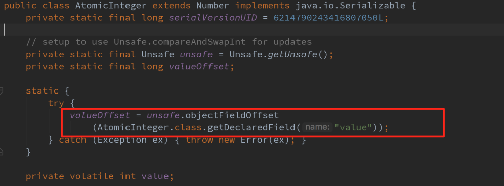
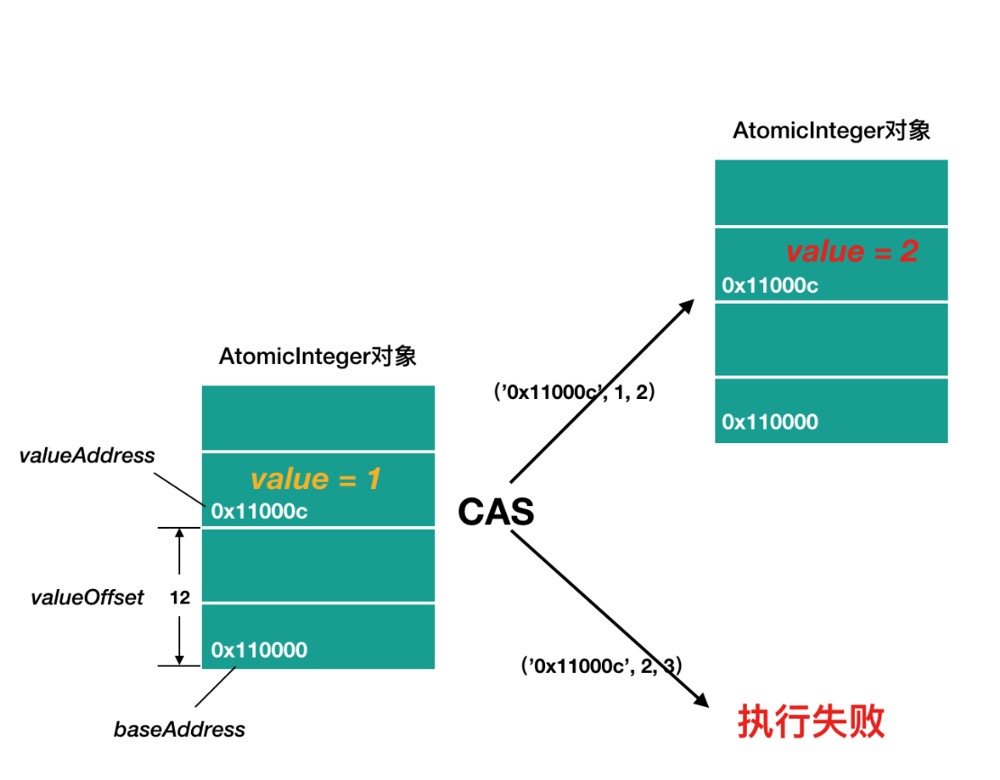

# sleep()

sleep() 允许 指定以毫秒为单位的一段时间作为参数，它使得线程在指定的时间内进入阻塞状态，不能得到CPU 时间，指定的时间一过，线程重新进入可执行状态。

> sleep() 可能会抛出 InterruptedException，因为异常不能跨线程传递回 main() 中，因此必须在本地进行处理。线程中抛出的其它异常也同样需要在本地进行处理。

# suspend() 和 resume() 

suspend()使得线程进入阻塞状态，并且不会自动恢复，必须其对应的resume() 被调用，才能使得线程重新进入可执行状态。

> **这两个 API 是过期的，也就是不建议使用的**。 不推荐使用 suspend() 去挂起线程的原因，是因为 suspend() 在导致线程暂停的同时，**并不会去释放任何锁资源**。

# yield()

重新争夺cpu时间片。

# join()

等待调用该方法的线程终止，当前线程转入阻塞状态，知道该线程运行结束。

# **synchronized**

同步锁也叫对象锁，是锁在对象上的，不同的对象就是不同的锁。

synchronized实际上使用对象锁保证临界区的**原子性** 临界区的代码是不可分割的 不会因为线程切换所打断

不要理解为一个线程加了锁 ，进入 synchronized代码块中就会一直执行下去。如果时间片切换了，也会执行其他线程，再切换回来会紧接着执行，只是不会执行到有竞争锁的资源，因为当前线程还未释放锁。

当一个线程执行完synchronized的代码块后 会唤醒正在等待的线程。


**加锁是加在对象上，一定要保证是同一对象，加锁才能生效**。

# wait() 和 notify()

`synchronized`解决了多线程竞争的问题，`wait`和`notify`解决多线程协调的问题。

不是一个普通的Java方法，而是定义在`Object`类的一个`native`方法，也就是由JVM的C代码实现的。其次，必须在`synchronized`块中才能调用`wait()`方法，因为`wait()`方法调用时，会*释放*线程获得的锁，`wait()`方法返回后，线程又会重新试图获得锁。

```java
public synchronized String getTask() {
    while (queue.isEmpty()) {
        // 释放this锁:
        this.wait();
        // 重新获取this锁
    }
    return queue.remove();
}
```

当一个线程在`this.wait()`等待时，它就会释放`this`锁，从而使得其他线程能够在`addTask()`方法获得`this`锁。

让等待的线程被重新唤醒，在相同的锁对象上调用`notify()`方法：

```java
public synchronized void addTask(String s) {
    this.queue.add(s);
    this.notify(); // 唤醒在this锁等待的线程
}
```

已唤醒的线程还需要重新获得锁后才能继续执行。

# interrupt()

中断一个线程非常简单，只需要在其他线程中对目标线程调用`interrupt()`方法，目标线程需要反复检测自身状态是否是interrupted状态，如果是，就立刻结束运行。

```java
public class Main {
    public static void main(String[] args) throws InterruptedException {
        Thread t = new MyThread();
        t.start();
        Thread.sleep(1); // 暂停1毫秒
        t.interrupt(); // 中断t线程
        t.join(); // 等待t线程结束
        System.out.println("end");
    }
}

class MyThread extends Thread {
    public void run() {
        int n = 0;
        while (! isInterrupted()) {
            n ++;
            System.out.println(n + " hello!");
        }
    }
}
```

要注意，`interrupt()`方法仅仅向`t`线程发出了“中断请求”，至于`t`线程是否能立刻响应，要看具体代码。而`t`线程的`while`循环会检测`isInterrupted()`，所以上述代码能正确响应`interrupt()`请求，使得自身立刻结束运行`run()`方法。

另一个常用的中断线程的方法是设置标志位。我们通常会用一个`running`标志位来标识线程是否应该继续运行，在外部线程中，通过把`HelloThread.running`置为`false`，就可以让线程结束：

```java
public class Main {
    public static void main(String[] args)  throws InterruptedException {
        HelloThread t = new HelloThread();
        t.start();
        Thread.sleep(1);
        t.running = false; // 标志位置为false
    }
}

class HelloThread extends Thread {
    public volatile boolean running = true;
    public void run() {
        int n = 0;
        while (running) {
            n ++;
            System.out.println(n + " hello!");
        }
        System.out.println("end!");
    }
}
```

标志位`boolean running`是一个线程间共享的变量。线程间共享变量需要使用`volatile`关键字标记，确保每个线程都能读取到更新后的变量值。

# volatile

线程间共享变量需要使用`volatile`关键字标记，确保每个线程都能读取到更新后的变量值。

为什么要对线程间共享的变量用关键字`volatile`声明？这涉及到Java的内存模型。在Java虚拟机中，变量的值保存在主内存中，但是，当线程访问变量时，它会先获取一个副本，并保存在自己的工作内存中。如果线程修改了变量的值，虚拟机会在某个时刻把修改后的值回写到主内存，但是，这个时间是不确定的！

```ascii
┌ ─ ─ ─ ─ ─ ─ ─ ─ ─ ─ ─ ─ ─ ─ ─ ┐
           Main Memory
│                               │
   ┌───────┐┌───────┐┌───────┐
│  │ var A ││ var B ││ var C │  │
   └───────┘└───────┘└───────┘
│     │ ▲               │ ▲     │
 ─ ─ ─│─│─ ─ ─ ─ ─ ─ ─ ─│─│─ ─ ─
      │ │               │ │
┌ ─ ─ ┼ ┼ ─ ─ ┐   ┌ ─ ─ ┼ ┼ ─ ─ ┐
      ▼ │               ▼ │
│  ┌───────┐  │   │  ┌───────┐  │
   │ var A │         │ var C │
│  └───────┘  │   │  └───────┘  │
   Thread 1          Thread 2
└ ─ ─ ─ ─ ─ ─ ┘   └ ─ ─ ─ ─ ─ ─ ┘
```

这会导致如果一个线程更新了某个变量，另一个线程读取的值可能还是更新前的。例如，主内存的变量`a = true`，线程1执行`a = false`时，它在此刻仅仅是把变量`a`的副本变成了`false`，主内存的变量`a`还是`true`，在JVM把修改后的`a`回写到主内存之前，其他线程读取到的`a`的值仍然是`true`，这就造成了多线程之间共享的变量不一致。

因此，`volatile`关键字的目的是告诉虚拟机：

- 每次访问变量时，总是获取主内存的最新值；
- 每次修改变量后，立刻回写到主内存。

`volatile`关键字解决的是可见性问题：当一个线程修改了某个共享变量的值，其他线程能够立刻看到修改后的值。

如果我们去掉`volatile`关键字，运行上述程序，发现效果和带`volatile`差不多，这是因为在x86的架构下，JVM回写主内存的速度非常快，但是，换成ARM的架构，就会有显著的延迟。

# 可重入锁

对同一个线程，能否在获取到锁以后继续获取同一个锁？

答案是肯定的。JVM允许同一个线程重复获取同一个锁，**这种能被同一个线程反复获取的锁，就叫做可重入锁**。

由于Java的线程锁是可重入锁，所以，获取锁的时候，不但要判断是否是第一次获取，还要记录这是第几次获取。每获取一次锁，记录+1，每退出`synchronized`块，记录-1，减到0的时候，才会真正释放锁。

# 死锁

一个线程可以获取一个锁后，再继续获取另一个锁。例如：

```java
public void add(int m) {
    synchronized(lockA) { // 获得lockA的锁
        this.value += m;
        synchronized(lockB) { // 获得lockB的锁
            this.another += m;
        } // 释放lockB的锁
    } // 释放lockA的锁
}

public void dec(int m) {
    synchronized(lockB) { // 获得lockB的锁
        this.another -= m;
        synchronized(lockA) { // 获得lockA的锁
            this.value -= m;
        } // 释放lockA的锁
    } // 释放lockB的锁
}
```

两个线程各自持有不同的锁，然后各自试图获取对方手里的锁，造成了双方无限等待下去，这就是死锁。

死锁发生后，没有任何机制能解除死锁，只能强制结束JVM进程。

因此，在编写多线程应用时，要特别注意防止死锁。因为死锁一旦形成，就只能强制结束进程。

# Semaphore

要保证同一时刻最多有N个线程能访问，比如同一时刻最多创建100个数据库连接，最多允许10个用户下载等。

这种限制数量的锁，如果用Lock数组来实现，就太麻烦了。

这种情况就可以使用`Semaphore`，例如，最多允许3个线程同时访问：

```java
public class AccessLimitControl {
    // 任意时刻仅允许最多3个线程获取许可:
    final Semaphore semaphore = new Semaphore(3);

    public String access() throws Exception {
        // 如果超过了许可数量,其他线程将在此等待:
        semaphore.acquire();
        try {
            // TODO:
            return UUID.randomUUID().toString();
        } finally {
            semaphore.release();
        }
    }
}
```

使用`Semaphore`先调用`acquire()`获取，然后通过`try ... finally`保证在`finally`中释放。

调用`acquire()`可能会进入等待，直到满足条件为止。也可以使用`tryAcquire()`指定等待时间：

```java
if (semaphore.tryAcquire(3, TimeUnit.SECONDS)) {
    // 指定等待时间3秒内获取到许可:
    try {
        // TODO:
    } finally {
        semaphore.release();
    }
}
```

# Atomic

Java的`java.util.concurrent`包除了提供底层锁、并发集合外，还提供了一组原子操作的封装类，它们位于`java.util.concurrent.atomic`包。

我们以`AtomicInteger`为例，它提供的主要操作有：

- 增加值并返回新值：`int addAndGet(int delta)`
- 加1后返回新值：`int incrementAndGet()`
- 获取当前值：`int get()`
- 用CAS方式设置：`int compareAndSet(int expect, int update)`

Atomic类是通过无锁（lock-free）的方式实现的线程安全（thread-safe）访问。它的主要原理是利用了CAS：Compare and Set。

如果我们自己通过CAS编写`incrementAndGet()`，它大概长这样：

```java
public int incrementAndGet(AtomicInteger var) {
    int prev, next;
    do {
        prev = var.get();
        next = prev + 1;
    } while ( ! var.compareAndSet(prev, next));
    return next;
}
```

我们利用`AtomicLong`可以编写一个多线程安全的全局唯一ID生成器：

```java
class IdGenerator {
    AtomicLong var = new AtomicLong(0);

    public long getNextId() {
        return var.incrementAndGet();
    }
}
```

## **CAS是什么？**

CAS是英文单词**CompareAndSwap**的缩写，中文意思是：比较并替换。CAS需要有3个操作数：内存地址V，旧的预期值A，即将要更新的目标值B。

CAS指令执行时，当且仅当内存地址V的值与预期值A相等时，将内存地址V的值修改为B，否则就什么都不做。**整个比较并替换的操作是一个原子操作。**

## **AtomicInteger**

AtomicInteger的实现中，静态字段valueOffset即为字段value的内存偏移地址，valueOffset的值在AtomicInteger初始化时，在静态代码块中通过Unsafe的objectFieldOffset方法获取。在AtomicInteger中提供的线程安全方法中，通过字段valueOffset的值可以定位到AtomicInteger对象中value的内存地址，从而可以根据CAS实现对value字段的原子操作。



下图为某个AtomicInteger对象自增操作前后的内存示意图，对象的基地址baseAddress=“0x110000”，通过baseAddress+valueOffset得到value的内存地址valueAddress=“0x11000c”；然后通过CAS进行原子性的更新操作，成功则返回，否则继续重试，直到更新成功为止。

