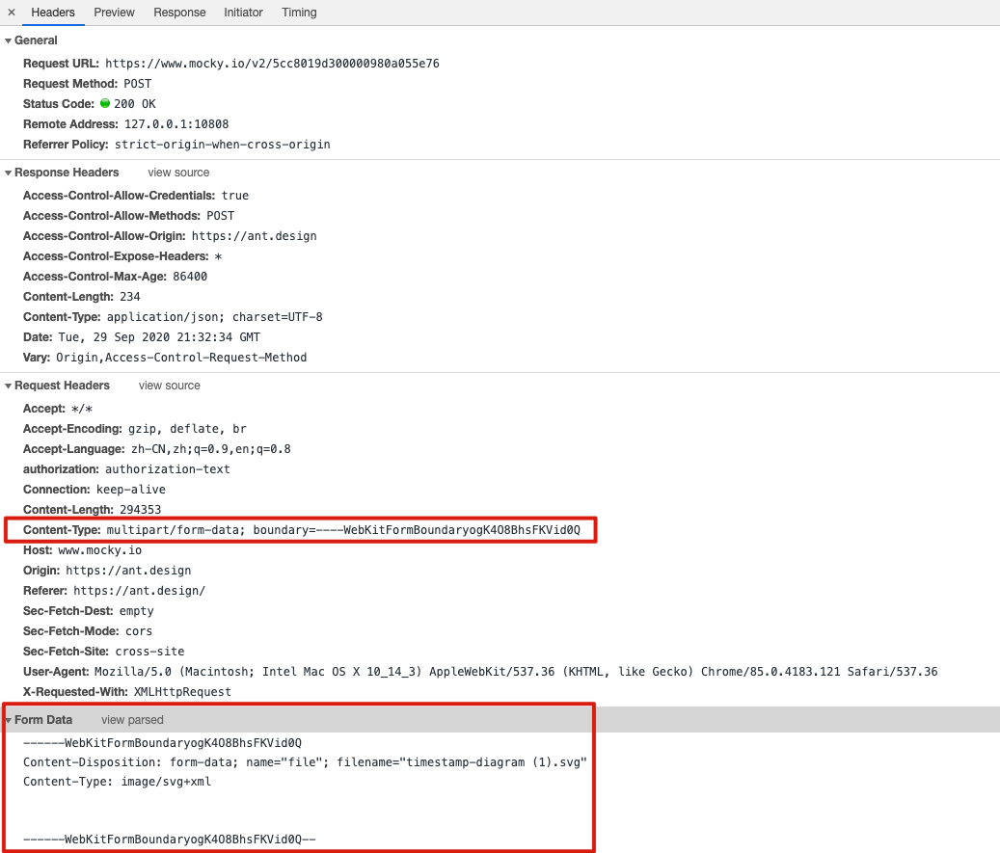

下面是OkHttp官方文档的一个Post例子：

```java
public static final MediaType JSON
    = MediaType.get("application/json; charset=utf-8");

OkHttpClient client = new OkHttpClient();

String post(String url, String json) throws IOException {
  RequestBody body = RequestBody.create(json, JSON);
  Request request = new Request.Builder()
      .url(url)
      .post(body)
      .build();
  try (Response response = client.newCall(request).execute()) {
    return response.body().string();
  }
}
```

POST 与GET不同，POST 做的一般是修改和删除的工作，与数据库交互，所以一般不使用缓存。OKHttp的缓存策略也仅限也GET方法。这里着重分析POST请求体的构造与请求流程。

## HTTP 请求报文

HTTP是一种文本协议，报文中的每一个字段都是一些ASCII码串，各个字段的长度是不确定的。HTTP方法中几种请求报文的结构基本一致，如下：


例子：

```
POST hysj.jsp HTTP/1.1
Host: search.cnipr.com
User-Agent: Mozilla/5.0 (Windows;U;Windows NT 6.9;zh-CN;rv:1.9.1.13)Gecko/20100914 Firefox/3.5.13 (.NET CLR 3.5.30729)
Accept: text/html, application/xhtml+xml,application/xml;q=0.9,*/*;q=0.8
Accept-Language: zh-cn,zh;q=0.5
Accept-Encoding: gzip,deflate
Accept-Charst: GN2312,utf-8;q=0.7,*;q=0.7
Keep-Alive: 300
Connection: keep-alive
Referer: http://search.cnipr.com/cnipr/zljs/hyjs-biaodan-y.jsp
Content-Length: 405

pageNo=0&pageSize=10&orderNum=306735659327926273&customerMobile=15626000000&startTime=2019-02-01%2000:00:00&endTime=2019-02-25%2014:54:20&status=SUCCESS&source=WECHAT_SHOPPING&canteenId=104&refundStatus=REFUNDED&startPayTime=2019-02-01%2000:00:00&endPayTime=2019-02-25%2014:54:47
```

### 分隔符

HTTP行的字段间用空格分割，行与行之间用回车符和换行符分割，关键字和值用英文冒号 “:” 分隔。

### 请求行

```
POST hysj.jsp HTTP/1.1
```

### 请求头

```
Host: search.cnipr.com
User-Agent: Mozilla/5.0 (Windows;U;Windows NT 6.9;zh-CN;rv:1.9.1.13)Gecko/20100914 Firefox/3.5.13 (.NET CLR 3.5.30729)
Accept: text/html, application/xhtml+xml,application/xml;q=0.9,*/*;q=0.8
Accept-Language: zh-cn,zh;q=0.5
Accept-Encoding: gzip,deflate
Accept-Charst: GN2312,utf-8;q=0.7,*;q=0.7
Keep-Alive: 300
Connection: keep-alive
Referer: http://search.cnipr.com/cnipr/zljs/hyjs-biaodan-y.jsp
Content-Length: 405
```


请求Header的说明：

| 请求头            | 说明                                   |
| ----------------- | -------------------------------------- |
| Accept            | 表示浏览器接受的数据类型               |
| Accept-Encoding   | 表示浏览器接受的数据压缩格式           |
| Host              | 表示当前请求访问的目标地址             |
| Authorization     | 表示用户身份认证信息                   |
| User-Agent        | 表示浏览器类型                         |
| If-Modified-Since | 表示当前请求资源最近一次更新时间       |
| If-None-Match     | 表示当前请求资源最近一次标识的 ETag 值 |
| Cookie            | 表示浏览器保存的 Cookie 信息           |
| Referer           | 表示标识请求引用自哪个地址             |

### 请求体

HTTP 请求的请求体有三种不同的形式：

1. **任意请求体**：移动开发常见的，请求体是任意类型的，服务器不会解析请求体，请求体的处理需要自己解析，如 POST、JSON 的时候就是这类
2. **查询字符串**：URL 中 Query String 的格式要求，多个键值对之间用 `&` 连接，键与值之间用 `=` 连接，且只能用 ASCII 字符，非 ASCII 字符需使用 `UrlEncode` 编码
3. **文件上传**：当需要实现 **文件上传** 时，请求体会被分成多个部分，每个字段 / 文件都被首部字段 `Content-Type` 的 **boundary** 指令指定的值分成单独的段，每段以 `--` 加 `boundary` 指令的值开头，然后是该段的描述头，描述头之后空一行接内容，请求结束的标识为 `boundary` 后面加 `--`



区分是否被当成文件的关键是  `Content-Disposition` 是否包含  `filename`，因为文件有不同的类型，所以还要使用  `Content-Type` 指示文件的类型，如果不知道是什么类型取值可以为 `application/octet-stream` 表示文件是一个二进制的文件，如果不是文件则 `Content-Type` 可以省略。

后面围绕RequestBody的这几种情况分析。

## RequestBody

```java
public abstract class RequestBody {
  /** Returns the Content-Type header for this body. */
  public abstract @Nullable MediaType contentType();

  /**
   * Returns the number of bytes that will be written to {@code sink} in a call to {@link #writeTo},
   * or -1 if that count is unknown.
   */
  public long contentLength() throws IOException {
    return -1;
  }

  /** Writes the content of this request to {@code sink}. */
  public abstract void writeTo(BufferedSink sink) throws IOException;

  /**
   * Returns a new request body that transmits {@code content}. If {@code contentType} is non-null
   * and lacks a charset, this will use UTF-8.
   */
  public static RequestBody create(@Nullable MediaType contentType, String content) {
    Charset charset = Util.UTF_8;
    if (contentType != null) {
      charset = contentType.charset();
      if (charset == null) {
        charset = Util.UTF_8;
        contentType = MediaType.parse(contentType + "; charset=utf-8");
      }
    }
    byte[] bytes = content.getBytes(charset);
    return create(contentType, bytes);
  }

  /** Returns a new request body that transmits {@code content}. */
  public static RequestBody create(
      final @Nullable MediaType contentType, final ByteString content) {
    return new RequestBody() {
      @Override public @Nullable MediaType contentType() {
        return contentType;
      }

      @Override public long contentLength() throws IOException {
        return content.size();
      }

      @Override public void writeTo(BufferedSink sink) throws IOException {
        sink.write(content);
      }
    };
  }

  /** Returns a new request body that transmits {@code content}. */
  public static RequestBody create(final @Nullable MediaType contentType, final byte[] content) {
    return create(contentType, content, 0, content.length);
  }

  /** Returns a new request body that transmits {@code content}. */
  public static RequestBody create(final @Nullable MediaType contentType, final byte[] content,
      final int offset, final int byteCount) {
    if (content == null) throw new NullPointerException("content == null");
    Util.checkOffsetAndCount(content.length, offset, byteCount);
    return new RequestBody() {
      @Override public @Nullable MediaType contentType() {
        return contentType;
      }

      @Override public long contentLength() {
        return byteCount;
      }

      @Override public void writeTo(BufferedSink sink) throws IOException {
        sink.write(content, offset, byteCount);
      }
    };
  }

  /** Returns a new request body that transmits the content of {@code file}. */
  public static RequestBody create(final @Nullable MediaType contentType, final File file) {
    if (file == null) throw new NullPointerException("content == null");

    return new RequestBody() {
      @Override public @Nullable MediaType contentType() {
        return contentType;
      }

      @Override public long contentLength() {
        return file.length();
      }

      @Override public void writeTo(BufferedSink sink) throws IOException {
        Source source = null;
        try {
          source = Okio.source(file);
          sink.writeAll(source);
        } finally {
          Util.closeQuietly(source);
        }
      }
    };
  }
}

```

RequestBody是一个抽象类，核心方法有以下三个：

```java
      @Override public @Nullable MediaType contentType() {}
      @Override public long contentLength() {}
      @Override public void writeTo(BufferedSink sink) throws IOException {}
```

前两个是数据类型和数据长度，后面的write方法用的是square公司开源的IO框架Okio中的一个类，这个类封装了OutputStream，即本质是一个输出流。

`create`方法重要的是两个两个重载：

```java
public static RequestBody create(final @Nullable MediaType contentType, final byte[] content,
      final int offset, final int byteCount) 
public static RequestBody create(final @Nullable MediaType contentType, final File file) 
```

String数据和file数据都可以轻松转换成byte数组，由于File文件较大，转换成Byte数组太占内存，所以提供了File数据的专用方法。

### FormBody

FormBody是RequestBody子类，专门用于上传键值对数据。

基本用法如下,典型的建造者模式：

```java
        FormBody.Builder fb = new FormBody.Builder();
        fb.add("k","v");
        fb.add("k2","v2");
        RequestBody requestBody = fb.build();
```

在内部类Builder里键值被放倒了两个数组中，

```java
public static final class Builder {
    private final List<String> names = new ArrayList<>();
    private final List<String> values = new ArrayList<>();
    private final Charset charset;

    public Builder() {
      this(null);
    }

    public Builder(Charset charset) {
      this.charset = charset;
    }

    public Builder add(String name, String value) {
      if (name == null) throw new NullPointerException("name == null");
      if (value == null) throw new NullPointerException("value == null");

      names.add(HttpUrl.canonicalize(name, FORM_ENCODE_SET, false, false, true, true, charset));
      values.add(HttpUrl.canonicalize(value, FORM_ENCODE_SET, false, false, true, true, charset));
      return this;
    }

    public Builder addEncoded(String name, String value) {
      if (name == null) throw new NullPointerException("name == null");
      if (value == null) throw new NullPointerException("value == null");

      names.add(HttpUrl.canonicalize(name, FORM_ENCODE_SET, true, false, true, true, charset));
      values.add(HttpUrl.canonicalize(value, FORM_ENCODE_SET, true, false, true, true, charset));
      return this;
    }

    public FormBody build() {
      return new FormBody(names, values);
    }
  }
```

继承的write最终调用writeOrCountBytes，键值对以'='分割写入buffer中，同时计算数据长度：

```java
  private long writeOrCountBytes(@Nullable BufferedSink sink, boolean countBytes) {
    long byteCount = 0L;

    Buffer buffer;
    if (countBytes) {
      buffer = new Buffer();
    } else {
      buffer = sink.buffer();
    }

    for (int i = 0, size = encodedNames.size(); i < size; i++) {
      if (i > 0) buffer.writeByte('&');
      buffer.writeUtf8(encodedNames.get(i));
      buffer.writeByte('=');
      buffer.writeUtf8(encodedValues.get(i));
    }

    if (countBytes) {
      byteCount = buffer.size();
      buffer.clear();
    }

    return byteCount;
  }
```

contentLength通过传入null来判断数据长度，上面的代码当BufferedSink为null时仅计数同时清空buffer。

```java
  @Override public long contentLength() {
    return writeOrCountBytes(null, true);
  }
```

### MultipartBody

这个类是多重的body，即可以上传键值对数据，又可以同时上传File数据。

和FormBody类似，MultipartBody也使用了建造者模式：

```java
public static final class Builder {
    private final ByteString boundary;
    private MediaType type = MIXED;
    private final List<Part> parts = new ArrayList<>();

    public Builder() {
      this(UUID.randomUUID().toString());
    }

    public Builder(String boundary) {
      this.boundary = ByteString.encodeUtf8(boundary);
    }

    /**
     * Set the MIME type. Expected values for {@code type} are {@link #MIXED} (the default), {@link
     * #ALTERNATIVE}, {@link #DIGEST}, {@link #PARALLEL} and {@link #FORM}.
     */
    public Builder setType(MediaType type) {
      if (type == null) {
        throw new NullPointerException("type == null");
      }
      if (!type.type().equals("multipart")) {
        throw new IllegalArgumentException("multipart != " + type);
      }
      this.type = type;
      return this;
    }

    /** Add a part to the body. */
    public Builder addPart(RequestBody body) {
      return addPart(Part.create(body));
    }

    /** Add a part to the body. */
    public Builder addPart(@Nullable Headers headers, RequestBody body) {
      return addPart(Part.create(headers, body));
    }

    /** Add a form data part to the body. */
    public Builder addFormDataPart(String name, String value) {
      return addPart(Part.createFormData(name, value));
    }

    /** Add a form data part to the body. */
    public Builder addFormDataPart(String name, @Nullable String filename, RequestBody body) {
      return addPart(Part.createFormData(name, filename, body));
    }

    /** Add a part to the body. */
    public Builder addPart(Part part) {
      if (part == null) throw new NullPointerException("part == null");
      parts.add(part);
      return this;
    }

    /** Assemble the specified parts into a request body. */
    public MultipartBody build() {
      if (parts.isEmpty()) {
        throw new IllegalStateException("Multipart body must have at least one part.");
      }
      return new MultipartBody(boundary, type, parts);
    }
  }
```

内部类Part封装了请求体类型为multipart/form-data的一部分（Part），每个Part可能时k-v键值或文件，如上文对请求体介绍，每个Part之间有一串文本分界符分割。

Builder构造时生成了Part之间的分割符：

```java
    public Builder() {
      this(UUID.randomUUID().toString());
    }

    public Builder(String boundary) {
      this.boundary = ByteString.encodeUtf8(boundary);
    }
```

Part内处理了相关的Content-Disposition，filename之类的头部信息，内部的RequestBody对应其他类型的请求体，处理其content length以及write等逻辑。

```java
private long writeOrCountBytes(
      @Nullable BufferedSink sink, boolean countBytes) throws IOException {
    long byteCount = 0L;

    Buffer byteCountBuffer = null;
    if (countBytes) {
      sink = byteCountBuffer = new Buffer();
    }

    for (int p = 0, partCount = parts.size(); p < partCount; p++) {
      Part part = parts.get(p);
      Headers headers = part.headers;
      RequestBody body = part.body;

      sink.write(DASHDASH);
      sink.write(boundary);
      sink.write(CRLF);

      if (headers != null) {
        for (int h = 0, headerCount = headers.size(); h < headerCount; h++) {
          sink.writeUtf8(headers.name(h))
              .write(COLONSPACE)
              .writeUtf8(headers.value(h))
              .write(CRLF);
        }
      }

      MediaType contentType = body.contentType();
      if (contentType != null) {
        sink.writeUtf8("Content-Type: ")
            .writeUtf8(contentType.toString())
            .write(CRLF);
      }

      long contentLength = body.contentLength();
      if (contentLength != -1) {
        sink.writeUtf8("Content-Length: ")
            .writeDecimalLong(contentLength)
            .write(CRLF);
      } else if (countBytes) {
        // We can't measure the body's size without the sizes of its components.
        byteCountBuffer.clear();
        return -1L;
      }

      sink.write(CRLF);

      if (countBytes) {
        byteCount += contentLength;
      } else {
        body.writeTo(sink);
      }

      sink.write(CRLF);
    }

    sink.write(DASHDASH);
    sink.write(boundary);
    sink.write(DASHDASH);
    sink.write(CRLF);

    if (countBytes) {
      byteCount += byteCountBuffer.size();
      byteCountBuffer.clear();
    }

    return byteCount;
  }
```

了解了HTTP Post报文结构的话，理解上面这部分代码就很容易了。一个for循环将所有的请求体合并写入，最后写入分割符结束并统计content length。

## Request

Request代表了整个请求报文，headers包含了请求头的参数，对于Post请求，携带的内容在其body字段。

```java
public final class Request {
  final HttpUrl url;
  final String method;
  final Headers headers;
  final @Nullable RequestBody body;
  final Object tag;

  private volatile CacheControl cacheControl; // Lazily initialized.

  Request(Builder builder) {
    this.url = builder.url;
    this.method = builder.method;
    this.headers = builder.headers.build();
    this.body = builder.body;
    this.tag = builder.tag != null ? builder.tag : this;
  }

  public HttpUrl url() {
    return url;
  }

  public String method() {
    return method;
  }

  public Headers headers() {
    return headers;
  }

  public @Nullable String header(String name) {
    return headers.get(name);
  }

  public List<String> headers(String name) {
    return headers.values(name);
  }

  public @Nullable RequestBody body() {
    return body;
  }

  public Object tag() {
    return tag;
  }

  public Builder newBuilder() {
    return new Builder(this);
  }

  /**
   * Returns the cache control directives for this response. This is never null, even if this
   * response contains no {@code Cache-Control} header.
   */
  public CacheControl cacheControl() {
    CacheControl result = cacheControl;
    return result != null ? result : (cacheControl = CacheControl.parse(headers));
  }

  public boolean isHttps() {
    return url.isHttps();
  }

  @Override public String toString() {
    return "Request{method="
        + method
        + ", url="
        + url
        + ", tag="
        + (tag != this ? tag : null)
        + '}';
  }

  public static class Builder {
    HttpUrl url;
    String method;
    Headers.Builder headers;
    RequestBody body;
    Object tag;

    public Builder() {
      this.method = "GET";
      this.headers = new Headers.Builder();
    }

    Builder(Request request) {
      this.url = request.url;
      this.method = request.method;
      this.body = request.body;
      this.tag = request.tag;
      this.headers = request.headers.newBuilder();
    }

    public Builder url(HttpUrl url) {
      if (url == null) throw new NullPointerException("url == null");
      this.url = url;
      return this;
    }

    /**
     * Sets the URL target of this request.
     *
     * @throws IllegalArgumentException if {@code url} is not a valid HTTP or HTTPS URL. Avoid this
     * exception by calling {@link HttpUrl#parse}; it returns null for invalid URLs.
     */
    public Builder url(String url) {
      if (url == null) throw new NullPointerException("url == null");

      // Silently replace web socket URLs with HTTP URLs.
      if (url.regionMatches(true, 0, "ws:", 0, 3)) {
        url = "http:" + url.substring(3);
      } else if (url.regionMatches(true, 0, "wss:", 0, 4)) {
        url = "https:" + url.substring(4);
      }

      HttpUrl parsed = HttpUrl.parse(url);
      if (parsed == null) throw new IllegalArgumentException("unexpected url: " + url);
      return url(parsed);
    }

    /**
     * Sets the URL target of this request.
     *
     * @throws IllegalArgumentException if the scheme of {@code url} is not {@code http} or {@code
     * https}.
     */
    public Builder url(URL url) {
      if (url == null) throw new NullPointerException("url == null");
      HttpUrl parsed = HttpUrl.get(url);
      if (parsed == null) throw new IllegalArgumentException("unexpected url: " + url);
      return url(parsed);
    }

    /**
     * Sets the header named {@code name} to {@code value}. If this request already has any headers
     * with that name, they are all replaced.
     */
    public Builder header(String name, String value) {
      headers.set(name, value);
      return this;
    }

    /**
     * Adds a header with {@code name} and {@code value}. Prefer this method for multiply-valued
     * headers like "Cookie".
     *
     * <p>Note that for some headers including {@code Content-Length} and {@code Content-Encoding},
     * OkHttp may replace {@code value} with a header derived from the request body.
     */
    public Builder addHeader(String name, String value) {
      headers.add(name, value);
      return this;
    }

    /** Removes all headers named {@code name} on this builder. */
    public Builder removeHeader(String name) {
      headers.removeAll(name);
      return this;
    }

    /** Removes all headers on this builder and adds {@code headers}. */
    public Builder headers(Headers headers) {
      this.headers = headers.newBuilder();
      return this;
    }

    /**
     * Sets this request's {@code Cache-Control} header, replacing any cache control headers already
     * present. If {@code cacheControl} doesn't define any directives, this clears this request's
     * cache-control headers.
     */
    public Builder cacheControl(CacheControl cacheControl) {
      String value = cacheControl.toString();
      if (value.isEmpty()) return removeHeader("Cache-Control");
      return header("Cache-Control", value);
    }

    public Builder get() {
      return method("GET", null);
    }

    public Builder head() {
      return method("HEAD", null);
    }

    public Builder post(RequestBody body) {
      return method("POST", body);
    }

    public Builder delete(@Nullable RequestBody body) {
      return method("DELETE", body);
    }

    public Builder delete() {
      return delete(Util.EMPTY_REQUEST);
    }

    public Builder put(RequestBody body) {
      return method("PUT", body);
    }

    public Builder patch(RequestBody body) {
      return method("PATCH", body);
    }

    public Builder method(String method, @Nullable RequestBody body) {
      if (method == null) throw new NullPointerException("method == null");
      if (method.length() == 0) throw new IllegalArgumentException("method.length() == 0");
      if (body != null && !HttpMethod.permitsRequestBody(method)) {
        throw new IllegalArgumentException("method " + method + " must not have a request body.");
      }
      if (body == null && HttpMethod.requiresRequestBody(method)) {
        throw new IllegalArgumentException("method " + method + " must have a request body.");
      }
      this.method = method;
      this.body = body;
      return this;
    }

    /**
     * Attaches {@code tag} to the request. It can be used later to cancel the request. If the tag
     * is unspecified or null, the request is canceled by using the request itself as the tag.
     */
    public Builder tag(Object tag) {
      this.tag = tag;
      return this;
    }

    public Request build() {
      if (url == null) throw new IllegalStateException("url == null");
      return new Request(this);
    }
  }
}

```

OKHttp悄摸摸地把ws改换成http，谁能告我为啥？

```java
      // Silently replace web socket URLs with HTTP URLs.
      if (url.regionMatches(true, 0, "ws:", 0, 3)) {
        url = "http:" + url.substring(3);
      } else if (url.regionMatches(true, 0, "wss:", 0, 4)) {
        url = "https:" + url.substring(4);
      }
```

然后又是一个Builder，将请求头和请求体合并成一个Http请求，请求方法涵盖了Http协议的几种方法GET，Post，HEAD，DELETE，PUT，PATCH等。

## Call

Request代表报文本身，Call则代表了请求这一行为。`client.newCall`最终会走到`newRealCall`,RealCall是Call接口的实现。

```java
  static RealCall newRealCall(OkHttpClient client, Request originalRequest, boolean forWebSocket) {
    // Safely publish the Call instance to the EventListener.
    RealCall call = new RealCall(client, originalRequest, forWebSocket);
    call.eventListener = client.eventListenerFactory().create(call);
    return call;
  }
```

```java
  @Override public Response execute() throws IOException {
    synchronized (this) {
      if (executed) throw new IllegalStateException("Already Executed");
      executed = true;
    }
    captureCallStackTrace();
    eventListener.callStart(this);
    try {
      client.dispatcher().executed(this);
      Response result = getResponseWithInterceptorChain();
      if (result == null) throw new IOException("Canceled");
      return result;
    } catch (IOException e) {
      eventListener.callFailed(this, e);
      throw e;
    } finally {
      client.dispatcher().finished(this);
    }
  }

  @Override public void enqueue(Callback responseCallback) {
    synchronized (this) {
      if (executed) throw new IllegalStateException("Already Executed");
      executed = true;
    }
    captureCallStackTrace();
    eventListener.callStart(this);
    client.dispatcher().enqueue(new AsyncCall(responseCallback));
  }
```

请求有同步阻塞execute和异步队列enqueue两种情形，最终都会交到client的dispatcher处理。execute请求结束后返回Response结果，enqueue将传入的callback传入新生成的AsyncCall继续处理。

```java
  final class AsyncCall extends NamedRunnable {
    private final Callback responseCallback;

    AsyncCall(Callback responseCallback) {
      super("OkHttp %s", redactedUrl());
      this.responseCallback = responseCallback;
    }

    String host() {
      return originalRequest.url().host();
    }

    Request request() {
      return originalRequest;
    }

    RealCall get() {
      return RealCall.this;
    }

    @Override protected void execute() {
      boolean signalledCallback = false;
      try {
        Response response = getResponseWithInterceptorChain();
        if (retryAndFollowUpInterceptor.isCanceled()) {
          signalledCallback = true;
          responseCallback.onFailure(RealCall.this, new IOException("Canceled"));
        } else {
          signalledCallback = true;
          responseCallback.onResponse(RealCall.this, response);
        }
      } catch (IOException e) {
        if (signalledCallback) {
          // Do not signal the callback twice!
          Platform.get().log(INFO, "Callback failure for " + toLoggableString(), e);
        } else {
          eventListener.callFailed(RealCall.this, e);
          responseCallback.onFailure(RealCall.this, e);
        }
      } finally {
        client.dispatcher().finished(this);
      }
    }
  }
```

AsyncCall本质上是个Runnable，Response通过getResponseWithInterceptorChain方法返回，这个是OKHttp的责任链模式。

## 责任链

先上经典代码：

```java
  Response getResponseWithInterceptorChain() throws IOException {
    // Build a full stack of interceptors.
    List<Interceptor> interceptors = new ArrayList<>();
    interceptors.addAll(client.interceptors());
    interceptors.add(retryAndFollowUpInterceptor);
    interceptors.add(new BridgeInterceptor(client.cookieJar()));
    interceptors.add(new CacheInterceptor(client.internalCache()));
    interceptors.add(new ConnectInterceptor(client));
    if (!forWebSocket) {
      interceptors.addAll(client.networkInterceptors());
    }
    interceptors.add(new CallServerInterceptor(forWebSocket));

    Interceptor.Chain chain = new RealInterceptorChain(interceptors, null, null, null, 0,
        originalRequest, this, eventListener, client.connectTimeoutMillis(),
        client.readTimeoutMillis(), client.writeTimeoutMillis());

    return chain.proceed(originalRequest);
  }
```

这里的每个`Interceptor`是进行具体工作的模块，包括用户定义的`client.interceptors()`，负责失败重试以及重定向的 `RetryAndFollowUpInterceptor`，负责把用户构造的请求转换为发送到服务器的请求、把服务器返回的响应转换为用户友好的响应的 `BridgeInterceptor`，负责读取缓存直接返回、更新缓存的 `CacheInterceptor`，负责和服务器建立连接的 `ConnectInterceptor`，用户定义的`client.networkInterceptors()`，和负责向服务器发送请求数据、从服务器读取响应数据的 `CallServerInterceptor`。

而`Chain`类则是辅助interceptors执行的工具类。`Chain`的构造函数的第5个参数表示`index`，代表第i个及以后的interceptor是有效的。`index`的初始值是0，每执行一个interceptor，它的值都会增加1。调用`Chain.proceed(Request)`时，会从第i个interceptor开始依次执行，最终返回一个response对象。每个`interceptor.intercept()`方法会调用`Chain.proceed()`来执行其后的interceptors。这样所有的interceptors可以依次被调用。时序图如下：


```java
public final class RealInterceptorChain implements Interceptor.Chain {
  private final List<Interceptor> interceptors;
  private final StreamAllocation streamAllocation;
  private final HttpCodec httpCodec;
  private final RealConnection connection;
  private final int index;
  private final Request request;
  private final Call call;
  private final EventListener eventListener;
  private final int connectTimeout;
  private final int readTimeout;
  private final int writeTimeout;
  private int calls;

  public RealInterceptorChain(List<Interceptor> interceptors, StreamAllocation streamAllocation,
      HttpCodec httpCodec, RealConnection connection, int index, Request request, Call call,
      EventListener eventListener, int connectTimeout, int readTimeout, int writeTimeout) {
    this.interceptors = interceptors;
    this.connection = connection;
    this.streamAllocation = streamAllocation;
    this.httpCodec = httpCodec;
    this.index = index;
    this.request = request;
    this.call = call;
    this.eventListener = eventListener;
    this.connectTimeout = connectTimeout;
    this.readTimeout = readTimeout;
    this.writeTimeout = writeTimeout;
  }

  @Override public Connection connection() {
    return connection;
  }

  @Override public int connectTimeoutMillis() {
    return connectTimeout;
  }

  @Override public Interceptor.Chain withConnectTimeout(int timeout, TimeUnit unit) {
    int millis = checkDuration("timeout", timeout, unit);
    return new RealInterceptorChain(interceptors, streamAllocation, httpCodec, connection, index,
        request, call, eventListener, millis, readTimeout, writeTimeout);
  }

  @Override public int readTimeoutMillis() {
    return readTimeout;
  }

  @Override public Interceptor.Chain withReadTimeout(int timeout, TimeUnit unit) {
    int millis = checkDuration("timeout", timeout, unit);
    return new RealInterceptorChain(interceptors, streamAllocation, httpCodec, connection, index,
        request, call, eventListener, connectTimeout, millis, writeTimeout);
  }

  @Override public int writeTimeoutMillis() {
    return writeTimeout;
  }

  @Override public Interceptor.Chain withWriteTimeout(int timeout, TimeUnit unit) {
    int millis = checkDuration("timeout", timeout, unit);
    return new RealInterceptorChain(interceptors, streamAllocation, httpCodec, connection, index,
        request, call, eventListener, connectTimeout, readTimeout, millis);
  }

  public StreamAllocation streamAllocation() {
    return streamAllocation;
  }

  public HttpCodec httpStream() {
    return httpCodec;
  }

  @Override public Call call() {
    return call;
  }

  public EventListener eventListener() {
    return eventListener;
  }

  @Override public Request request() {
    return request;
  }

  @Override public Response proceed(Request request) throws IOException {
    return proceed(request, streamAllocation, httpCodec, connection);
  }

  public Response proceed(Request request, StreamAllocation streamAllocation, HttpCodec httpCodec,
      RealConnection connection) throws IOException {
    if (index >= interceptors.size()) throw new AssertionError();

    calls++;

    // If we already have a stream, confirm that the incoming request will use it.
    if (this.httpCodec != null && !this.connection.supportsUrl(request.url())) {
      throw new IllegalStateException("network interceptor " + interceptors.get(index - 1)
          + " must retain the same host and port");
    }

    // If we already have a stream, confirm that this is the only call to chain.proceed().
    if (this.httpCodec != null && calls > 1) {
      throw new IllegalStateException("network interceptor " + interceptors.get(index - 1)
          + " must call proceed() exactly once");
    }

    // Call the next interceptor in the chain.
    RealInterceptorChain next = new RealInterceptorChain(interceptors, streamAllocation, httpCodec,
        connection, index + 1, request, call, eventListener, connectTimeout, readTimeout,
        writeTimeout);
    Interceptor interceptor = interceptors.get(index);
    Response response = interceptor.intercept(next);

    // Confirm that the next interceptor made its required call to chain.proceed().
    if (httpCodec != null && index + 1 < interceptors.size() && next.calls != 1) {
      throw new IllegalStateException("network interceptor " + interceptor
          + " must call proceed() exactly once");
    }

    // Confirm that the intercepted response isn't null.
    if (response == null) {
      throw new NullPointerException("interceptor " + interceptor + " returned null");
    }

    if (response.body() == null) {
      throw new IllegalStateException(
          "interceptor " + interceptor + " returned a response with no body");
    }

    return response;
  }
}
```

关键部分，chain的proceed方法中拿出下一个interceptor调用其拦截方法：

```java
    // Call the next interceptor in the chain.
    RealInterceptorChain next = new RealInterceptorChain(interceptors, streamAllocation, httpCodec,
        connection, index + 1, request, call, eventListener, connectTimeout, readTimeout,
        writeTimeout);
    Interceptor interceptor = interceptors.get(index);
    Response response = interceptor.intercept(next);
```

Interceptor很多，我们找一个BridgeInterceptor：

```java
  @Override public Response intercept(Chain chain) throws IOException {
    Request userRequest = chain.request();
    Request.Builder requestBuilder = userRequest.newBuilder();

    RequestBody body = userRequest.body();
    if (body != null) {
      MediaType contentType = body.contentType();
      if (contentType != null) {
        requestBuilder.header("Content-Type", contentType.toString());
      }

      long contentLength = body.contentLength();
      if (contentLength != -1) {
        requestBuilder.header("Content-Length", Long.toString(contentLength));
        requestBuilder.removeHeader("Transfer-Encoding");
      } else {
        requestBuilder.header("Transfer-Encoding", "chunked");
        requestBuilder.removeHeader("Content-Length");
      }
    }

    if (userRequest.header("Host") == null) {
      requestBuilder.header("Host", hostHeader(userRequest.url(), false));
    }

    if (userRequest.header("Connection") == null) {
      requestBuilder.header("Connection", "Keep-Alive");
    }

    // If we add an "Accept-Encoding: gzip" header field we're responsible for also decompressing
    // the transfer stream.
    boolean transparentGzip = false;
    if (userRequest.header("Accept-Encoding") == null && userRequest.header("Range") == null) {
      transparentGzip = true;
      requestBuilder.header("Accept-Encoding", "gzip");
    }

    List<Cookie> cookies = cookieJar.loadForRequest(userRequest.url());
    if (!cookies.isEmpty()) {
      requestBuilder.header("Cookie", cookieHeader(cookies));
    }

    if (userRequest.header("User-Agent") == null) {
      requestBuilder.header("User-Agent", Version.userAgent());
    }

    Response networkResponse = chain.proceed(requestBuilder.build());
```

BridgeInterceptor负责把用户构造的请求转换为发送给服务器的请求，把服务器返回的响应转换为对用户友好的响应。 在Request阶段配置用户信息，并添加一些请求头。在Response阶段，进行gzip解压。

可以看到其做完相应工作后调用`chain.proceed`,当然request经过了其requestBuilder的处理，在`chain.proceed`后又继续调用下一个拦截器，后面才是Response的处理。Request的处理层层递进，Response的处理又相应层层返回。