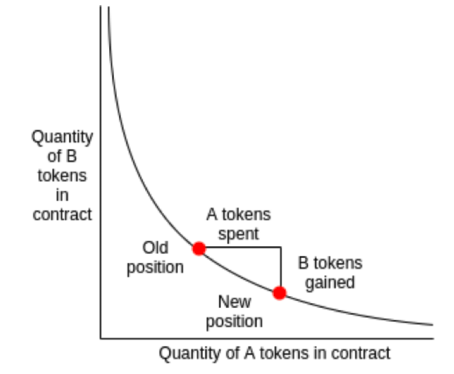

uniswap-v2 版本智能合约部分的代码存放在 [uniswap-v2-core](https://link.segmentfault.com/?enc=mqYnT4yS2oWzb1hAnNjL7A%3D%3D.fUMH0X8O2ys%2FCli6zdIn0IevBKRKqzUlgPC3AwrDvJm%2B1fljOsZhcxRofviF2aSK) 和 [uniswap-v2-periphery](https://link.segmentfault.com/?enc=v32HZWQG9Fp8zek55tzxow%3D%3D.A4RRursBjUgk1iYPYLJdlybZnJMDJa3Y67ydMdAOFUCcXt7Q%2F55cf7QxFUTUZ9YT) 两个仓库

> [[科普]由浅入深理解UniswapV3白皮书](https://learnblockchain.cn/article/3055)

# UniswapV2Pair


```solidity
pragma solidity =0.5.16;

import './interfaces/IUniswapV2Pair.sol';
import './UniswapV2ERC20.sol';

// 一个自定义的Math库，只有两个功能，一个是求两个uint的最小值，另一个是对一个uint进行开方运算。
import './libraries/Math.sol';

// 自定义的数据格式库。在UniswapV2中，价格为两种代币的数量比值，而在Solidity中，对非整数类型支持不好，通常两个无符号整数相除为地板除，会截断。
// 为了提高价格精度，UniswapV2使用uint112来保存交易对中资产的数量，而比值（价格）使用UQ112x112表示，一个代表整数部分，一个代表小数部分。
import './libraries/UQ112x112.sol';

// 标准ERC20接口，在获取交易对合约资产池的代币数量（余额）时使用。
import './interfaces/IERC20.sol';

// 导入factory合约相关接口，主要是用来获取开发团队手续费地址。
import './interfaces/IUniswapV2Factory.sol';

// 有些第三方合约希望接收到代币后进行其它操作，好比异步执行中的回调函数。
// 这里IUniswapV2Callee约定了第三方合约如果需要执行回调函数必须实现的接口格式。当然了，定义了此接口后还可以进行FlashSwap。
import './interfaces/IUniswapV2Callee.sol';

contract UniswapV2Pair is IUniswapV2Pair, UniswapV2ERC20 {
    using SafeMath  for uint;
    using UQ112x112 for uint224;

    // 定义了最小流动性。它是最小数值1的1000倍，用来在提供初始流动性时燃烧掉。
    uint public constant MINIMUM_LIQUIDITY = 10**3;

    // 用来计算标准ERC20合约中转移代币函数transfer的函数选择器。
    // 虽然标准的ERC20合约在转移代币后返回一个成功值，但有些不标准的并没有返回值。
    // 在这个合约里统一做了处理，并使用了较低级的call函数代替正常的合约调用。函数选择器用于call函数调用中。
    // 获取transfer方法的bytecode前四个字节
    bytes4 private constant SELECTOR = bytes4(keccak256(bytes('transfer(address,uint256)')));

    // 用来记录factory合约地址和交易对中两种代币的合约地址。
    address public factory;
    address public token0;
    address public token1;

    // 这三个状态变量记录了最新的恒定乘积中两种资产的数量和交易时的区块（创建）时间
    uint112 private reserve0;           // uses single storage slot, accessible via getReserves
    uint112 private reserve1;           // uses single storage slot, accessible via getReserves
    uint32  private blockTimestampLast; // uses single storage slot, accessible via getReserves

    // 记录交易对中两种价格的累计值。
    uint public price0CumulativeLast;
    uint public price1CumulativeLast;
    // 记录某一时刻恒定乘积中积的值，主要用于开发团队手续费计算。
    uint public kLast; // reserve0 * reserve1, as of immediately after the most recent liquidity event

    uint private unlocked = 1;
    modifier lock() {
        require(unlocked == 1, 'UniswapV2: LOCKED');
        unlocked = 0;
        _;
        unlocked = 1;
    }

    // 用于获取两个代币在池子中的数量和最后更新的时间
    function getReserves() public view returns (uint112 _reserve0, uint112 _reserve1, uint32 _blockTimestampLast) {
        _reserve0 = reserve0;
        _reserve1 = reserve1;
        _blockTimestampLast = blockTimestampLast;
    }

    // 使用call函数进行代币合约transfer的调用（使用了函数选择器）。
    // 注意，它检查了返回值（首先必须调用成功，然后无返回值或者返回值为true）。
    function _safeTransfer(address token, address to, uint value) private {
        (bool success, bytes memory data) = token.call(abi.encodeWithSelector(SELECTOR, to, value));
        require(success && (data.length == 0 || abi.decode(data, (bool))), 'UniswapV2: TRANSFER_FAILED');
    }

    event Mint(address indexed sender, uint amount0, uint amount1);
    event Burn(address indexed sender, uint amount0, uint amount1, address indexed to);
    event Swap(
        address indexed sender,
        uint amount0In,
        uint amount1In,
        uint amount0Out,
        uint amount1Out,
        address indexed to
    );
    event Sync(uint112 reserve0, uint112 reserve1);

    constructor() public {
        factory = msg.sender;
    }

    // 因为factory合约使用create2函数创建交易对合约，无法向构造器传递参数，所以这里写了一个初始化函数用来记录合约中两种代币的地址。
    // called once by the factory at time of deployment
    function initialize(address _token0, address _token1) external {
        require(msg.sender == factory, 'UniswapV2: FORBIDDEN'); // sufficient check
        token0 = _token0;
        token1 = _token1;
    }

    // 这个函数是用来更新价格oracle的，计算累计价格
    // update reserves and, on the first call per block, price accumulators
    function _update(uint balance0, uint balance1, uint112 _reserve0, uint112 _reserve1) private {
        // 防止溢出
        require(balance0 <= uint112(-1) && balance1 <= uint112(-1), 'UniswapV2: OVERFLOW');
        uint32 blockTimestamp = uint32(block.timestamp % 2**32);
        uint32 timeElapsed = blockTimestamp - blockTimestampLast; // overflow is desired
        // 计算时间加权的累计价格，256位中，前112位用来存整数，后112位用来存小数，多的32位用来存溢出的值
        if (timeElapsed > 0 && _reserve0 != 0 && _reserve1 != 0) {
            // * never overflows, and + overflow is desired
            price0CumulativeLast += uint(UQ112x112.encode(_reserve1).uqdiv(_reserve0)) * timeElapsed;
            price1CumulativeLast += uint(UQ112x112.encode(_reserve0).uqdiv(_reserve1)) * timeElapsed;
        }
        reserve0 = uint112(balance0);
        reserve1 = uint112(balance1);
        blockTimestampLast = blockTimestamp;
        emit Sync(reserve0, reserve1);
    }

    // if fee is on, mint liquidity equivalent to 1/6th of the growth in sqrt(k)
    function _mintFee(uint112 _reserve0, uint112 _reserve1) private returns (bool feeOn) {
        address feeTo = IUniswapV2Factory(factory).feeTo();
        feeOn = feeTo != address(0);
        uint _kLast = kLast; // gas savings
        if (feeOn) {
            if (_kLast != 0) {
                uint rootK = Math.sqrt(uint(_reserve0).mul(_reserve1));
                uint rootKLast = Math.sqrt(_kLast);
                if (rootK > rootKLast) {
                    uint numerator = totalSupply.mul(rootK.sub(rootKLast));
                    uint denominator = rootK.mul(5).add(rootKLast);
                    uint liquidity = numerator / denominator;
                    if (liquidity > 0) _mint(feeTo, liquidity);
                }
            }
        } else if (_kLast != 0) {
            kLast = 0;
        }
    }

    // this low-level function should be called from a contract which performs important safety checks
    function mint(address to) external lock returns (uint liquidity) {
        (uint112 _reserve0, uint112 _reserve1,) = getReserves(); // gas savings
        // 合约里两种token的当前的balance
        uint balance0 = IERC20(token0).balanceOf(address(this));
        uint balance1 = IERC20(token1).balanceOf(address(this));
        // 获得当前balance和上一次缓存的余额的差值
        uint amount0 = balance0.sub(_reserve0);
        uint amount1 = balance1.sub(_reserve1);

        // 计算手续费
        bool feeOn = _mintFee(_reserve0, _reserve1);
        uint _totalSupply = totalSupply; // gas savings, must be defined here since totalSupply can update in _mintFee
        if (_totalSupply == 0) {
            // 第一次铸币，也就是第一次注入流动性，值为根号k减去MINIMUM_LIQUIDITY
            liquidity = Math.sqrt(amount0.mul(amount1)).sub(MINIMUM_LIQUIDITY);
            // 把MINIMUM_LIQUIDITY赋给地址0，永久锁住
           _mint(address(0), MINIMUM_LIQUIDITY); // permanently lock the first MINIMUM_LIQUIDITY tokens
        } else {
            // 计算增量的token占总池子的比例，作为新铸币的数量
            liquidity = Math.min(amount0.mul(_totalSupply) / _reserve0, amount1.mul(_totalSupply) / _reserve1);
        }
        require(liquidity > 0, 'UniswapV2: INSUFFICIENT_LIQUIDITY_MINTED');
        // 铸币，修改to的token数量及totalsupply
        _mint(to, liquidity);
        // 更新时间加权平均价格
        _update(balance0, balance1, _reserve0, _reserve1);
        if (feeOn) kLast = uint(reserve0).mul(reserve1); // reserve0 and reserve1 are up-to-date
        emit Mint(msg.sender, amount0, amount1);
    }

    // this low-level function should be called from a contract which performs important safety checks
    function burn(address to) external lock returns (uint amount0, uint amount1) {
        (uint112 _reserve0, uint112 _reserve1,) = getReserves(); // gas savings
        address _token0 = token0;                                // gas savings
        address _token1 = token1;                                // gas savings
        // 分别获取本合约地址中token0、token1和本合约代币的数量
        uint balance0 = IERC20(_token0).balanceOf(address(this));
        uint balance1 = IERC20(_token1).balanceOf(address(this));
        // 此时用户的LP token已经被转移至合约地址，因此这里取合约地址中的LP Token余额就是等下要burn掉的量
        uint liquidity = balanceOf[address(this)];

        bool feeOn = _mintFee(_reserve0, _reserve1);
        uint _totalSupply = totalSupply; // gas savings, must be defined here since totalSupply can update in _mintFee
        // 根据liquidity占比获取两个代币的实际数量
        amount0 = liquidity.mul(balance0) / _totalSupply; // using balances ensures pro-rata distribution
        amount1 = liquidity.mul(balance1) / _totalSupply; // using balances ensures pro-rata distribution
        require(amount0 > 0 && amount1 > 0, 'UniswapV2: INSUFFICIENT_LIQUIDITY_BURNED');
        // 销毁LP Token
        _burn(address(this), liquidity);
        // 将token0和token1转给地址to
        _safeTransfer(_token0, to, amount0);
        _safeTransfer(_token1, to, amount1);
        balance0 = IERC20(_token0).balanceOf(address(this));
        balance1 = IERC20(_token1).balanceOf(address(this));

        // 更新时间加权平均价格
        _update(balance0, balance1, _reserve0, _reserve1);
        if (feeOn) kLast = uint(reserve0).mul(reserve1); // reserve0 and reserve1 are up-to-date
        emit Burn(msg.sender, amount0, amount1, to);
    }

    // this low-level function should be called from a contract which performs important safety checks
    function swap(uint amount0Out, uint amount1Out, address to, bytes calldata data) external lock {
        require(amount0Out > 0 || amount1Out > 0, 'UniswapV2: INSUFFICIENT_OUTPUT_AMOUNT');
        (uint112 _reserve0, uint112 _reserve1,) = getReserves(); // gas savings
        require(amount0Out < _reserve0 && amount1Out < _reserve1, 'UniswapV2: INSUFFICIENT_LIQUIDITY');

        uint balance0;
        uint balance1;
        { // scope for _token{0,1}, avoids stack too deep errors
        address _token0 = token0;
        address _token1 = token1;
        require(to != _token0 && to != _token1, 'UniswapV2: INVALID_TO');
        if (amount0Out > 0) _safeTransfer(_token0, to, amount0Out); // optimistically transfer tokens
        if (amount1Out > 0) _safeTransfer(_token1, to, amount1Out); // optimistically transfer tokens
        if (data.length > 0) IUniswapV2Callee(to).uniswapV2Call(msg.sender, amount0Out, amount1Out, data);
        balance0 = IERC20(_token0).balanceOf(address(this));
        balance1 = IERC20(_token1).balanceOf(address(this));
        }
        uint amount0In = balance0 > _reserve0 - amount0Out ? balance0 - (_reserve0 - amount0Out) : 0;
        uint amount1In = balance1 > _reserve1 - amount1Out ? balance1 - (_reserve1 - amount1Out) : 0;
        require(amount0In > 0 || amount1In > 0, 'UniswapV2: INSUFFICIENT_INPUT_AMOUNT');
        { // scope for reserve{0,1}Adjusted, avoids stack too deep errors
        uint balance0Adjusted = balance0.mul(1000).sub(amount0In.mul(3));
        uint balance1Adjusted = balance1.mul(1000).sub(amount1In.mul(3));
        require(balance0Adjusted.mul(balance1Adjusted) >= uint(_reserve0).mul(_reserve1).mul(1000**2), 'UniswapV2: K');
        }

        _update(balance0, balance1, _reserve0, _reserve1);
        emit Swap(msg.sender, amount0In, amount1In, amount0Out, amount1Out, to);
    }

    // 强制交易对合约中两种代币的实际余额和保存的恒定乘积中的资产数量一致（多余的发送给调用者）。
    // 注意：任何人都可以调用该函数来获取额外的资产（前提是如果存在多余的资产）。
    // force balances to match reserves
    function skim(address to) external lock {
        address _token0 = token0; // gas savings
        address _token1 = token1; // gas savings
        _safeTransfer(_token0, to, IERC20(_token0).balanceOf(address(this)).sub(reserve0));
        _safeTransfer(_token1, to, IERC20(_token1).balanceOf(address(this)).sub(reserve1));
    }

    // 和skim函数刚好相反，强制保存的恒定乘积的资产数量为交易对合约中两种代币的实际余额，用于处理一些特殊情况。
    // 通常情况下，交易对中代币余额和保存的恒定乘积中的资产数量是相等的。
    // force reserves to match balances
    function sync() external lock {
        _update(IERC20(token0).balanceOf(address(this)), IERC20(token1).balanceOf(address(this)), reserve0, reserve1);
    }
}

```

# UniswapV2Factory
```solidity
pragma solidity =0.5.16;

import './interfaces/IUniswapV2Factory.sol';
import './UniswapV2Pair.sol';

contract UniswapV2Factory is IUniswapV2Factory {
    // uniswap中每次交易代币会收取0.3%的手续费，目前全部分给了LQ，若此地址不为0时，将会分出手续费中的1/6给这个地址
    address public feeTo;
    address public feeToSetter;

    mapping(address => mapping(address => address)) public getPair;
    address[] public allPairs;

    event PairCreated(address indexed token0, address indexed token1, address pair, uint);

    constructor(address _feeToSetter) public {
        feeToSetter = _feeToSetter;
    }

    function allPairsLength() external view returns (uint) {
        return allPairs.length;
    }

    function createPair(address tokenA, address tokenB) external returns (address pair) {
        // 必须是两个不一样的ERC20合约地址
        require(tokenA != tokenB, 'UniswapV2: IDENTICAL_ADDRESSES');
        // 让tokenA和tokenB的地址从小到大排列
        (address token0, address token1) = tokenA < tokenB ? (tokenA, tokenB) : (tokenB, tokenA);
        // token地址不能是0
        require(token0 != address(0), 'UniswapV2: ZERO_ADDRESS');
        // 必须是uniswap中未创建过的pair
        require(getPair[token0][token1] == address(0), 'UniswapV2: PAIR_EXISTS'); // single check is sufficient
        // 获取模板合约UniswapV2Pair的creationCode
        bytes memory bytecode = type(UniswapV2Pair).creationCode;
        // 以两个token的地址作为种子生产salt
        bytes32 salt = keccak256(abi.encodePacked(token0, token1));
        // 直接调用汇编创建合约
        assembly {
            pair := create2(0, add(bytecode, 32), mload(bytecode), salt)
        }
        // 初始化刚刚创建的合约
        IUniswapV2Pair(pair).initialize(token0, token1);
        // 记录刚刚创建的合约对应的pair
        getPair[token0][token1] = pair;
        getPair[token1][token0] = pair; // populate mapping in the reverse direction
        allPairs.push(pair);
        emit PairCreated(token0, token1, pair, allPairs.length);
    }

    function setFeeTo(address _feeTo) external {
        require(msg.sender == feeToSetter, 'UniswapV2: FORBIDDEN');
        feeTo = _feeTo;
    }

    function setFeeToSetter(address _feeToSetter) external {
        require(msg.sender == feeToSetter, 'UniswapV2: FORBIDDEN');
        feeToSetter = _feeToSetter;
    }
}

```

# 设计思想

Uniswap是一个在以太坊上运行的交易所，支持ETH与Token，Token和Token之间的快速兑换，仅支持ERC20 Token。和股市之类的订单簿系统不同，Uniswap的设计使Token的价格完全根据人们在上面的交易自动调节。




## 易用性

在 Uniswap 交易所上买卖币时，你只要决定好卖出的币种、买入什么币、买或卖的数量是多少，
按下 Swap 送出交易，
在交易上链后就能立即取得你应得的币。

而且就算是 Token A 换 Token B，
在 Uniswap 也只要发出一笔交易就能完成兑换，

在其它交易所中可能需要发两笔交易（第一笔将 Token A 换成某种中介货币（如 ETH, DAI）再发第二笔交易换成 Token B）才能完成。

	Ø 注：实际上在 Uniswap 也是将 Token A 换成 ETH 再换成 Token B，只是它让这两个动作在同一笔交易里发生。
	Ø 注：V2 开始允许 Token-Token 交易对，并且允许多次 swap 在一个交易里完成，例如 USDC → USDT → ETH → WBTC。

## 简单的做市机制

Uniswap 不是采用挂单搓合机制来完成交易，
而是根据合约中储备的资金量算出当下的交易价格，并立刻从资金池中取出对应的金额传给使用者，整体的运算量相对较少。

## 抗审查性

就是没有门槛，任何使用者都能在 Uniswap 上架任何 Token。

任何使用者只要发起一个 createExchange 的交易，就能让一个 Token 上架到 Uniswap 的交易对中，上架后也没有人能迫使它下架。

大多数的去中心化交易所虽然不会像中心化交易所那样向你收取上币费 ，
但还是要申请上币、通过审查后，
运营团队才会让你的 Token 可以在他们的交易所上交易。

## 零抽租

在 Uniswap 的合约设计中，没有人有任何特权，开发团队也不从交易中抽取费用。
	Ø （注：V2 开始 Uniswap 开发团队有权抽取交易手续费的 0.05%）

但这不代表在 Uniswap 上交易是没有手续费的。

	- 要让交易被打包进以太坊区块链就要付 gas fee，
	- Uniswap 会对每一笔 ETH ⇄ Token 的交易抽取 0.3% 的费用，（Token ⇄ Token 的交易则会抽两次，共 0.5991%）这笔费用称为 liquidity provider fee（流动性提供者费用），会付给流动性提供者们。

## 流动性提供者（liquidity provider）

「流动性提供者」是一个金融术语，指的是帮助一个金融市场提高流动性的个体。

一个拥有越高流动性（市场深度越大）的交易所，其使用者就越能在短时间内以稳定的价格完成大额资产的交换，使用者的交易体验当然就越好。

反之，在一个流动性不足的交易所，就有可能因为一笔大额的交易导致币价剧烈波动。

在大部分的交易所中都有流动性提供者或做市商（market maker）这样的角色存在，

做市商会在买、卖两个方向上挂单，让想要交易的使用者只需要跟做市商的订单搓合就能完成交易，而不需要等待拥有相反需求的交易对手出现，市场流动性就能提高。

在 Uniswap，流动性提供者要做的事情是：
替一个 ETH - Token 交易对增加 ETH 与 Token 的储备资金，
储备金越多，ETH ⇄ Token 的交易价格就越稳定，
该 Token 的流动性就越高。 （注：从 V2 开始允许对 Token-Token 交易对提供流动性）

## 缺点

1. 不能自行决定买卖价格
你只能被动接受 Uniswap 给你的价格，
不能挂单在你想要的价格。

2. 交易费用不低
0.3% 的费用跟其它中心化、去中心化交易所比起来都算是偏高，
如果你的目标是尽量以漂亮的价格完成交易，
不建议使用 Uniswap。

3. Front Running（超前交易）
Front Running 在许多去中心化交易所、应用中都是一个问题。
简单地说，从你发出交易到交易上链之前，
其他人有机会赶在你的交易完成之前执行另一笔交易，
使得你的成交价格偏离预期，
你因此吃亏，
对方因此得益。

## 什么情况下适合使用 Uniswap？

1. 你需要支付某种你未持有的 Token 给其他人

比如你持有 ETH 而不持有 DAI，但突然需要付一笔 DAI 给别人，那你就非常适合用 Uniswap 的 Send 功能，让兑币、转帐一次完成。

2. 你打算长期持有 ETH 和一种 Token

如果你本来就打算长期持有 ETH 和一种 Token，
而且相信这两者的相对价格短时间内不会有太大的变化，
那你可以考虑将部分的 ETH 和 Token 放进 Uniswap 来赚取被动收入，
放进去的币也随时都可以领回。

但是如果你觉得这个 Token 相对于 ETH 的价格可能在近期上涨或下跌很多，
你投入 Uniswap 一段时间后再领回，
领回的币的总价值可能比不投入的情况还低

3. 你发行了一种 Token，想让它能够在链上交易

那你可以帮你的 Token 创建一个 Uniswap 交易对，
然后帮它 Add Liquidity。

4. 你是智能合约开发者，想要在合约里取得币价或转换一种币为另一种币

例如：你写了一个智能合约来收 ETH，
并且想要根据 ETH 当下的价格决定收取多少 ETH，
甚至在收钱的当下立刻把 ETH 换成稳定币，
那你可以去接链上的 Uniswap exchange contract 来完成这些功能，
V1 合约的介面在此。
V2 文件
另一个一样能用在这个情境的 DApp 是 KyberSwap，
但 KyberSwap 消耗的 gas 量大约是 Uniswap 的 3 倍以上，
所以如果你想要尽可能减少 gas cost 的话 Uniswap 就是首选了！

	- https://medium.com/taipei-ethereum-meetup/defi-uniswap-1-e36db975e4ae

## 争议：软件许可

Uniswap自从被SushiSwap进行吸血鬼攻击后，就有一点被动，特别是他们的通证发行计划可能就是在SushiSwap的刺激下不得不做的。

所以Uniswap这次对于软件许可也做了很大的改变（Business Source License 1.1），虽然最终还会给第三方直接使用权力的（GPL 2.0），但是在两年内，商业或生产级应用是不可以直接使用Uniswap V3代码的。

或许这是Uniswap 团队设置的一种护城河，当两年内可以积累足够的流动性之后，其他协议就算直接使用他们的代码，也无法提供像他们这样的流动性。

但是既然Uniswap V3的机制和方案是公开的，所以其他DeFi协议是不是会绕开它们具体的开源代码，而用其他的方式来实现，也未尝不可。而且，甚至某些团队本身就是匿名的，这些条款是否真的可以落实到，也可能是个问号。

## 滑点

滑点是什么？滑点是指下单的点位和最后成交的点位有差距，比如一个币种的资金池体量不够时，就会出现滑点，但当资金池中的ERC20代币和ETH的数量充足时，滑点的数额就会减少，而且资金越多，滑点越小。