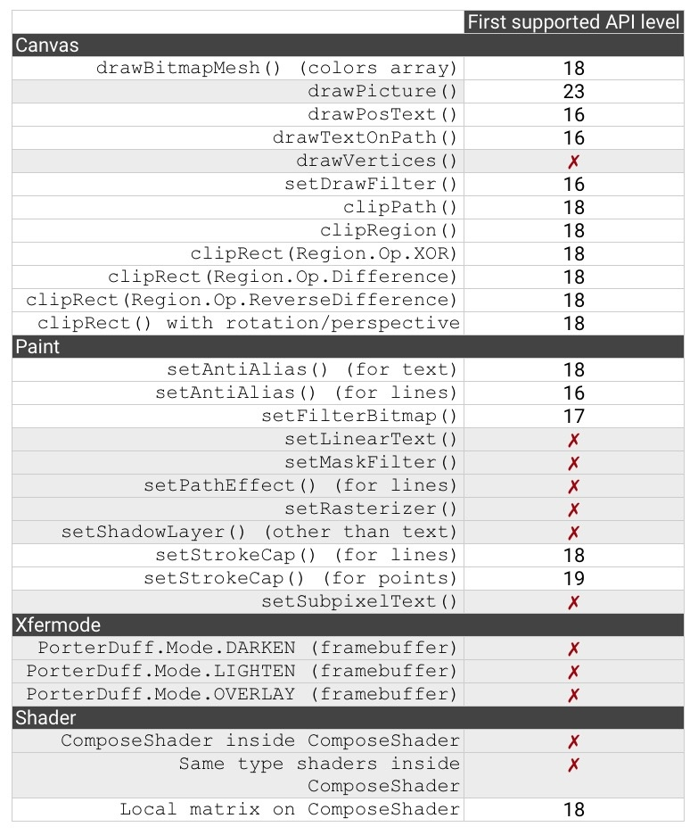

# Xfermode

整个 `View` 的显示区域都在画的时候参与计算，并且 `View` 自身的底色并不是默认的透明色，而且是遵循一种迷之逻辑，导致不仅绘制的是整个圆的范围，而且在范围之外都变成了黑色。


要想使用 `setXfermode()` 正常绘制，必须使用离屏缓存 (Off-screen Buffer) 把内容绘制在额外的层上，再把绘制好的内容贴回 View 中。


## 离屏缓冲

通过使用离屏缓冲，把要绘制的内容单独绘制在缓冲层， `Xfermode` 的使用就不会出现奇怪的结果了。

使用离屏缓冲有两种方式：

### `saveLayer()` 

可以做短时的离屏缓冲。使用方法很简单，在绘制代码的前后各加一行代码，在绘制之前保存，绘制之后恢复:

```java
int saved = canvas.saveLayer(null, null, Canvas.ALL_SAVE_FLAG);

  canvas.drawBitmap(rectBitmap, 0, 0, paint); // 画方
  paint.setXfermode(xfermode); // 设置 Xfermode
  canvas.drawBitmap(circleBitmap, 0, 0, paint); // 画圆
  paint.setXfermode(null); // 用完及时清除 Xfermode

  canvas.restoreToCount(saved);
```

### `View.setLayerType()`

直接把整个 `View` 都绘制在离屏缓冲中。 `setLayerType(LAYER_TYPE_HARDWARE)` 是使用 GPU 来缓冲， `setLayerType(LAYER_TYPE_SOFTWARE)` 是直接直接用一个 `Bitmap` 来缓冲。

## 使用

```java
 private final Xfermode mXfermode = new PorterDuffXfermode(PorterDuff.Mode.SRC_IN);
```

```java
// 注意 paint 复用带来的影响 
private Bitmap genShapeBitmap() {
        Bitmap bitmap = Bitmap.createBitmap(getWidth(), getHeight(), Bitmap.Config.ARGB_8888);
        Canvas canvas = new Canvas(bitmap);
        canvas.drawColor(bgColor);
        // ...
        return bitmap;
    }
```

```java
 @Override
    protected void onDraw(Canvas canvas) {
        int saved = canvas.saveLayer(null, null, Canvas.ALL_SAVE_FLAG);
        
        Bitmap bitmap = genShapeBitmap();
        rectF.set(0, 0, getWidth(), getHeight());
        canvas.drawBitmap(bitmap, null, rectF, mPaint);

        mPaint.setXfermode(mXfermode);
        canvas.drawBitmap(btBg, null, rectF, mPaint);
        mPaint.setXfermode(null);

        canvas.restoreToCount(saved);
    }
```

注意控制透明区域，SRC_IN 只有两张图都留有空白才能起到裁剪效果。


# Shader

「着色器」不是 Android 独有的，它是图形领域里一个通用的概念，它和直接设置颜色的区别是，着色器设置的是一个颜色方案，或者说是一套着色规则。当设置了 `Shader` 之后，`Paint` 在绘制图形和文字时就不使用 `setColor/ARGB()` 设置的颜色了，而是使用 `Shader` 的方案中的颜色。

## BitmapShader

如果你想绘制圆形的 `Bitmap`，就别用 `drawBitmap()` 了，改用 `drawCircle()` + `BitmapShader` 就可以了

```java
Bitmap bitmap = BitmapFactory.decodeResource(getResources(), R.drawable.batman);
Shader shader = new BitmapShader(bitmap, Shader.TileMode.CLAMP, Shader.TileMode.CLAMP);
paint.setShader(shader);
     
...
     
canvas.drawCircle(300, 300, 200, paint);
```


## LinearGradient 线性渐变

`CLAMP`, `MIRROR` 和 `REPEAT`。`CLAMP` 会在端点之外延续端点处的颜色；`MIRROR` 是镜像模式；`REPEAT` 是重复模式。

```java
Shader shader = new LinearGradient(100, 100, 500, 500, Color.parseColor("#E91E63"),
        Color.parseColor("#2196F3"), Shader.TileMode.CLAMP);
paint.setShader(shader);
// ...
paint.setShader(null);
```

## RadialGradient 辐射渐变

```java
/*
centerX centerY：辐射中心的坐标
radius：辐射半径
centerColor：辐射中心的颜色
edgeColor：辐射边缘的颜色
tileMode：辐射范围之外的着色模式。
*/
Shader shader = new RadialGradient(300, 300, 200, Color.parseColor("#E91E63"),
        Color.parseColor("#2196F3"), Shader.TileMode.CLAMP);
paint.setShader(shader);
```

## SweepGradient 扫描渐变

```java
Shader shader = new SweepGradient(300, 300, Color.parseColor("#E91E63"),
Color.parseColor("#2196F3"));
paint.setShader(shader);
```

```java
private int[] colors = new int[]{activeStartColor, activeEndColor};
private float[] positions = new float[]{0f, 0f};
positions[0] = 0;
positions[1] = progress;
Shader shader = new SweepGradient(getWidth() / 2f, getHeight() / 2f, colors, positions);
mPaint.setShader(shader);
```

## ComposeShader

所谓混合，就是把两个 `Shader` 一起使用。

参数：
 `shaderA`, `shaderB`：两个相继使用的 `Shader`
 `mode`: 两个 `Shader` 的叠加模式，即 `shaderA` 和 `shaderB` 应该怎样共同绘制。它的类型是 `PorterDuff.Mode` 

```java
// 第一个 Shader：头像的 Bitmap
Bitmap bitmap1 = BitmapFactory.decodeResource(getResources(), R.drawable.batman);
Shader shader1 = new BitmapShader(bitmap1, Shader.TileMode.CLAMP, Shader.TileMode.CLAMP);

// 第二个 Shader：从上到下的线性渐变（由透明到黑色）
Bitmap bitmap2 = BitmapFactory.decodeResource(getResources(), R.drawable.batman_logo);
Shader shader2 = new BitmapShader(bitmap2, Shader.TileMode.CLAMP, Shader.TileMode.CLAMP);

// ComposeShader：结合两个 Shader
Shader shader = new ComposeShader(shader1, shader2, PorterDuff.Mode.SRC_OVER);
paint.setShader(shader);
     
...
     
canvas.drawCircle(300, 300, 300, paint);
```

> 上面这段代码中使用了两个 `BitmapShader` 来作为 `ComposeShader()` 的参数，而 `ComposeShader()` 在硬件加速下是不支持两个相同类型的 `Shader` 的，所以这里需要关闭硬件加速才能看到效果。

# ColorFilter

颜色过滤的意思，就是为绘制的内容设置一个统一的过滤策略，然后 `Canvas.drawXXX()` 方法会对每个像素都进行过滤后再绘制出来。

在 `Paint` 里设置 `ColorFilter` ，使用的是 `Paint.setColorFilter(ColorFilter filter)` 方法。 `ColorFilter` 并不直接使用，而是使用它的子类。它共有三个子类：`LightingColorFilter` `PorterDuffColorFilter` 和 `ColorMatrixColorFilter`。

## LightingColorFilter

`LightingColorFilter` 的构造方法是 `LightingColorFilter(int mul, int add)` ，参数里的 `mul` 和 `add` 都是和颜色值格式相同的 int 值，其中 `mul` 用来和目标像素相乘，`add` 用来和目标像素相加。

一个「保持原样」的「基本 `LightingColorFilter` 」，`mul` 为 `0xffffff`，`add` 为 `0x000000`（也就是0），那么对于一个像素，它的计算过程就是：

```java
R' = R * 0xff / 0xff + 0x0 = R // R' = R
G' = G * 0xff / 0xff + 0x0 = G // G' = G
B' = B * 0xff / 0xff + 0x0 = B // B' = B
```

基于这个「基本 `LightingColorFilter` 」，你就可以修改一下做出其他的 filter。比如，如果你想去掉原像素中的红色，可以把它的 `mul` 改为 `0x00ffff` （红色部分为 0 ） ，那么它的计算过程就是：

```java
R' = R * 0x0 / 0xff + 0x0 = 0 // 红色被移除
G' = G * 0xff / 0xff + 0x0 = G
B' = B * 0xff / 0xff + 0x0 = B
```

具体效果是这样的：

```java
ColorFilter lightingColorFilter = new LightingColorFilter(0x00ffff, 0x000000);
paint.setColorFilter(lightingColorFilter);
```

或者，如果你想让它的绿色更亮一些，就可以把它的 `add` 改为 `0x003000` （绿色部分为 0x30 ），那么它的计算过程就是：

```java
R' = R * 0xff / 0xff + 0x0 = R
G' = G * 0xff / 0xff + 0x30 = G + 0x30 // 绿色被加强
B' = B * 0xff / 0xff + 0x0 = B
```

效果是这样：

```java
ColorFilter lightingColorFilter = new LightingColorFilter(0xffffff, 0x003000);
paint.setColorFilter(lightingColorFilter);
```

## ColorMatrixColorFilter

`ColorMatrixColorFilter` 使用一个 `ColorMatrix` 来对颜色进行处理。 `ColorMatrix` 这个类，内部是一个 4x5 的矩阵：

```
[ a, b, c, d, e,
  f, g, h, i, j,
  k, l, m, n, o,
  p, q, r, s, t ]
```

通过计算， `ColorMatrix` 可以把要绘制的像素进行转换。对于颜色 [R, G, B, A] ，转换算法是这样的：

```
R’ = a*R + b*G + c*B + d*A + e;
G’ = f*R + g*G + h*B + i*A + j;
B’ = k*R + l*G + m*B + n*A + o;
A’ = p*R + q*G + r*B + s*A + t;
```

`ColorMatrix` 有一些自带的方法可以做简单的转换，例如可以使用 `setSaturation(float sat)` 来设置饱和度；另外你也可以自己去设置它的每一个元素来对转换效果做精细调整。

## PorterDuffColorFilter

这个 `PorterDuffColorFilter` 的作用是使用一个指定的颜色和一种指定的 `PorterDuff.Mode` 来与绘制对象进行合成。它的构造方法是 `PorterDuffColorFilter(int color, PorterDuff.Mode mode)` 其中的 `color` 参数是指定的颜色， `mode` 参数是指定的 `Mode`。同样也是 `PorterDuff.Mode` ，不过和 `ComposeShader` 不同的是，`PorterDuffColorFilter` 作为一个 `ColorFilter`，只能指定一种颜色作为源，而不是一个 `Bitmap`。

# MaskFilter

```java
private final BlurMaskFilter blurMaskFilter = new BlurMaskFilter(10, BlurMaskFilter.Blur.OUTER);
mPaint.setMaskFilter(blurMaskFilter);
// 绘制外发光效果
canvas.drawArc(padding, padding, getWidth() - padding, getHeight() - padding, 45, 270 * progress, false, mPaint);
mPaint.setMaskFilter(null);
// 绘制内部
canvas.drawArc(padding, padding, getWidth() - padding, getHeight() - padding, 45, 270 * progress, false, mPaint);
```

```java
setLayerType(LAYER_TYPE_SOFTWARE, null);
```

# Paint

```java
paint.setFlags(Paint.ANTI_ALIAS_FLAG | Paint.DITHER_FLAG);
```

```java
// 设置拐角的形状
setStrokeJoin(Paint.Join join)
```

# Bitmap 抗锯齿

```java
private PaintFlagsDrawFilter mPaintFilter = new PaintFlagsDrawFilter(0, Paint.ANTI_ALIAS_FLAG | Paint.FILTER_BITMAP_FLAG);

canvas.setDrawFilter(mPaintFilter);
```

# Clip显示范围

```kotlin
 override fun onSizeChanged(
    w: Int,
    h: Int,
    oldw: Int,
    oldh: Int
  ) {
    super.onSizeChanged(w, h, oldw, oldh)
    this.path.apply {
      reset()
      addRoundRect(
        RectF(0f, 0f, w.toFloat(), h.toFloat()),
        floatArrayOf(radius, radius, radius, radius, radius, radius, radius, radius),
        Path.Direction.CCW
      )
    }
  }

  override fun dispatchDraw(canvas: Canvas) {
    canvas.clipPath(this.path)
    super.dispatchDraw(canvas)
  }
```

# 硬件加速

> https://developer.android.com/guide/topics/graphics/hardware-accel

从 Android 3.0（API 级别 11）开始，Android 2D 渲染管道支持硬件加速，也就是说，在 `View` 的画布上执行的所有绘制操作都会使用 GPU。启用硬件加速需要更多资源，因此应用会占用更多内存。

如果您的目标 API 级别为 14 及更高级别，则**硬件加速默认处于启用状态**，但也可以明确启用该功能。

您可以在以下级别控制硬件加速：

- 应用

```xml
<application android:hardwareAccelerated="true" ...>
```

- Activity

```xml
 <application android:hardwareAccelerated="true">
        <activity ... />
        <activity android:hardwareAccelerated="false" />
    </application>
```

- 窗口

```kotlin
window.setFlags(
            WindowManager.LayoutParams.FLAG_HARDWARE_ACCELERATED,
            WindowManager.LayoutParams.FLAG_HARDWARE_ACCELERATED
    )
```

- 视图

```kotlin
 myView.setLayerType(View.LAYER_TYPE_SOFTWARE, null)
```

> 您目前无法在视图级别启用硬件加速。除了停用硬件加速之外，视图层还具有其他功能。如需详细了解视图层的具体用途，请参阅[视图层](https://developer.android.com/guide/topics/graphics/hardware-accel#layers)。

## 确定视图是否经过硬件加速

您可以通过以下两种不同的方式检查应用是否经过硬件加速。

- 如果 `View` 已附加到硬件加速窗口，则 `View.isHardwareAccelerated()` 会返回 `true`。
- 如果 `Canvas` 经过硬件加速，则 `Canvas.isHardwareAccelerated()` 会返回 `true`

如果您必须在绘制代码中执行这项检查，请尽可能使用 `Canvas.isHardwareAccelerated()`，而不是 `View.isHardwareAccelerated()`。如果某个视图已附加到硬件加速窗口，则仍可以使用未经过硬件加速的画布进行绘制。例如，将视图绘制为位图以进行缓存就会发生这种情况。

## 限制

受到 GPU 绘制方式的限制，`Canvas` 的有些方法在硬件加速开启式会失效或无法正常工作。Xfermode，MaskFilter等不可用



## View Layer

1. 关闭硬件加速
2. 辅助属性动画

所谓 View Layer，又称为离屏缓冲（Off-screen Buffer），它的作用是单独启用一块地方来绘制这个 View ，而不是使用软件绘制的 Bitmap 或者通过硬件加速的 GPU。这块「地方」可能是一块单独的 `Bitmap`，也可能是一块 OpenGL 的纹理（texture，OpenGL 的纹理可以简单理解为图像的意思），具体取决于硬件加速是否开启。

当设置了 View Layer 的时候，它的**最终绘制结果会被缓存下来，而不是像硬件加速那样只是把 GPU 的操作保存下来再交给 GPU 去计算。**

### 辅助属性动画

基于这样的原理，在进行移动、旋转等（无需调用 `invalidate()`）的属性动画的时候开启 Hardware  Layer 将会极大地提升动画的效率，因为在动画过程中 View 本身并没有发生改变，只是它的位置或角度改变了，而这种改变是可以由 GPU  通过简单计算就完成的，并不需要重绘整个 View。所以在这种动画的过程中开启 Hardware  Layer，可以让本来就依靠硬件加速而变流畅了的动画变得更加流畅。

```java
view.setLayerType(LAYER_TYPE_HARDWARE, null);
ObjectAnimator animator = ObjectAnimator.ofFloat(view, "rotationY", 180);

animator.addListener(new AnimatorListenerAdapter() {
    @Override
    public void onAnimationEnd(Animator animation) {
        view.setLayerType(LAYER_TYPE_NONE, null);
    }
});

animator.start();
```

或者如果是使用 `ViewPropertyAnimator`，那么更简单：

```java
view.animate()
        .rotationY(90)
        .withLayer(); // withLayer() 可以自动完成上面这段代码的复杂操作
```

只有你在对 `translationX` `translationY` `rotation` `alpha` 等无需调用 `invalidate()` 的属性做动画的时候，这种方法才适用，因为这种方法本身利用的就是当界面不发生时，缓存未更新所带来的时间的节省。

#### 负面效果

由于设置了 View Layer 后，View 在初次绘制时以及每次 `invalidate()` 后重绘时，需要进行两次的绘制工作（一次绘制到 Layer，一次从 Layer 绘制到显示屏），所以其实它的每次绘制的效率是被降低了的。所以一定要慎重使用 View Layer，在需要用到它的时候再去使用。

### 关闭硬件加速

```java
view.setLayerType(LAYER_TYPE_SOFTWARE, null);
```

但这个方法其实是用来设置 View Layer 的，只是当它的参数为 `LAYER_TYPE_SOFTWARE` 的时候，可以「顺便」把硬件加速关掉而已；并且除了这个方法之外，Android 并没有提供专门的 View 级别的硬件加速开关。