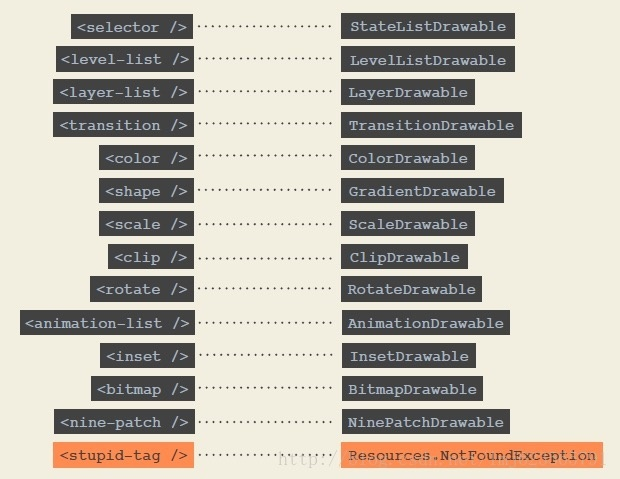
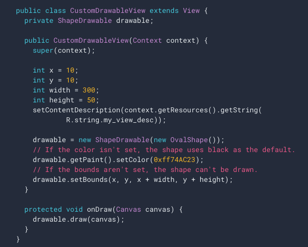

# Android原生Drawable




> https://developer.android.com/guide/topics/graphics/drawables?hl=zh-cn

https://developer.android.google.cn/guide/topics/graphics/drawables?hl=zh-cn



# 关键步骤

1. 要实现的最重要方法是 `draw(Canvas)`

2. **通过 getBounds.width() 和 getBounds.height() 获取宽高**


```java
public class CustomDrawableView extends View {
      private ShapeDrawable drawable;

      public CustomDrawableView(Context context) {
        super(context);
    
        int x = 10;
        int y = 10;
        int width = 300;
        int height = 50;
        setContentDescription(context.getResources().getString(
                R.string.my_view_desc));
    
        drawable = new ShapeDrawable(new OvalShape());
        // If the color isn't set, the shape uses black as the default.
        drawable.getPaint().setColor(0xff74AC23);
        // If the bounds aren't set, the shape can't be drawn.
        drawable.setBounds(x, y, x + width, y + height);
      }
    
      protected void onDraw(Canvas canvas) {
        drawable.draw(canvas);
      }
    }
```


```java
    public class MyDrawable extends Drawable {
        private final Paint redPaint;

        public MyDrawable() {
            // Set up color and text size
            redPaint = new Paint();
            redPaint.setARGB(255, 255, 0, 0);
        }

        @Override
        public void draw(Canvas canvas) {
            // Get the drawable's bounds
            int width = getBounds().width();
            int height = getBounds().height();
            float radius = Math.min(width, height) / 2;

            // Draw a red circle in the center
            canvas.drawCircle(width/2, height/2, radius, redPaint);
        }

        @Override
        public void setAlpha(int alpha) {
            rePaint.setAlpha(alpha);
            invalidateSelf();
        }

        @Override
        public void setColorFilter(ColorFilter colorFilter) {
            rePaint.setColorFilter(colorFilter);
            invalidateSelf();
        }

        @Override
        public int getOpacity() {
            // Must be PixelFormat.UNKNOWN, TRANSLUCENT, TRANSPARENT, or OPAQUE
            return PixelFormat.OPAQUE;
        }
    }
    
```

将可绘制对象添加到任意位置；例如添加到 `ImageView`（如下所示）：

```java
    MyDrawable mydrawing = new MyDrawable();
    ImageView image = findViewById(R.id.imageView);
    image.setImageDrawable(mydrawing);
    image.setContentDescription(getResources().getString(R.string.my_image_desc));
    
```

# 椭圆背景

```kotlin
import android.graphics.*
import android.graphics.drawable.Drawable

class RoundDrawable : Drawable() {

    var borderWidth = 3f
        set(value) {
            field = value
            invalidateSelf()
        }

    var borderColor = Color.RED
        set(value) {
            field = value
            invalidateSelf()
        }

    val paint = Paint(Paint.ANTI_ALIAS_FLAG)
    val rectF = RectF()

    var bgColor = Color.GRAY
        set(value) {
            field = value
            invalidateSelf()
        }

    override fun draw(canvas: Canvas) {
        paint.style = Paint.Style.FILL
        paint.color = bgColor
        rectF.set(0f, 0f, bounds.width().toFloat(), bounds.height().toFloat())
        canvas.drawRoundRect(rectF, bounds.height() / 2f, bounds.height() / 2f, paint)

        paint.style = Paint.Style.STROKE
        paint.color = borderColor
        paint.strokeWidth = borderWidth
        rectF.set(
            borderWidth / 2f,
            borderWidth / 2f,
            bounds.width() - borderWidth / 2f,
            bounds.height() - borderWidth / 2f
        )
        canvas.drawRoundRect(rectF, bounds.height() / 2f, bounds.height() / 2f, paint)

    }

    override fun setAlpha(alpha: Int) {
        // pass
    }

    override fun setColorFilter(colorFilter: ColorFilter?) {
        // pass
    }

    override fun getOpacity(): Int {
        return PixelFormat.OPAQUE
    }
}
```

# 生成圆角矩形Drawable

```java
public class DrawableUtil {

    private DrawableUtil() {
    }

    public static Drawable genDrawable(int color, int radiusDp) {
        return new Drawable() {

            private final Paint paint = new Paint(Paint.ANTI_ALIAS_FLAG);
            private final RectF rectf = new RectF();
            private final int radius = dp2px(radiusDp);

            {
                paint.setColor(color);
                paint.setStyle(Paint.Style.FILL);
            }

            @Override
            public void draw(@NonNull Canvas canvas) {
                rectf.set(0, 0, getBounds().width(), getBounds().height());
                canvas.drawRoundRect(rectf, radius, radius, paint);
            }

            @Override
            public void setAlpha(int alpha) {
                paint.setAlpha(alpha);
                invalidateSelf();
            }

            @Override
            public void setColorFilter(@Nullable ColorFilter colorFilter) {
                paint.setColorFilter(colorFilter);
                invalidateSelf();
            }

            @Override
            public int getOpacity() {
                return PixelFormat.OPAQUE;
            }

        };
    }

    public static int dp2px(int dp) {
        return (int) TypedValue.applyDimension(TypedValue.COMPLEX_UNIT_DIP, dp, Resources.getSystem().getDisplayMetrics());
    }

}
```

# StateListDrawable

```java
		Button btnTest = findViewById(R.id.btn_test);

        StateListDrawable stateListDrawable = new StateListDrawable();
        stateListDrawable.addState(new int[]{android.R.attr.state_pressed}, DrawableUtil.genDrawable(Color.GRAY, 10));
        stateListDrawable.addState(new int[]{}, DrawableUtil.genDrawable(Color.WHITE, 10));
        btnTest.setBackground(stateListDrawable);
```

> https://blog.csdn.net/hp910315/article/details/47832569

```java
@RequiresApi(api = Build.VERSION_CODES.LOLLIPOP)
    public static RippleDrawable getPressedColorRippleDrawable(int normalColor, int pressedColor) {
        return new RippleDrawable(getPressedColorSelector(normalColor, pressedColor), getColorDrawableFromColor(normalColor), null);
    }

    public static ColorStateList getPressedColorSelector(int normalColor, int pressedColor) {
        return new ColorStateList(
                new int[][]
                        {
                                new int[]{android.R.attr.state_pressed},
                                new int[]{android.R.attr.state_focused},
                                new int[]{android.R.attr.state_activated},
                                new int[]{}
                        },
                new int[]
                        {
                                pressedColor,
                                pressedColor,
                                pressedColor,
                                normalColor
                        }
        );
    }

    public static ColorDrawable getColorDrawableFromColor(int color) {
        return new ColorDrawable(color);
    }
```

# DrawableUtil

```java
public class DrawableUtil {

    private DrawableUtil() {
    }

    public static Drawable genDrawable(int color, int radiusDp) {
        return new Drawable() {

            private final Paint paint = new Paint(Paint.ANTI_ALIAS_FLAG);
            private final RectF rectf = new RectF();
            private final int radius = dp2px(radiusDp);

            {
                paint.setColor(color);
                paint.setStyle(Paint.Style.FILL);
            }

            @Override
            public void draw(@NonNull Canvas canvas) {
                rectf.set(0, 0, getBounds().width(), getBounds().height());
                canvas.drawRoundRect(rectf, radius, radius, paint);
            }

            @Override
            public void setAlpha(int alpha) {
                paint.setAlpha(alpha);
                invalidateSelf();
            }

            @Override
            public void setColorFilter(@Nullable ColorFilter colorFilter) {
                paint.setColorFilter(colorFilter);
                invalidateSelf();
            }

            @Override
            public int getOpacity() {
                return PixelFormat.OPAQUE;
            }

        };
    }

    public static int dp2px(int dp) {
        return (int) TypedValue.applyDimension(TypedValue.COMPLEX_UNIT_DIP, dp, Resources.getSystem().getDisplayMetrics());
    }


    @RequiresApi(api = Build.VERSION_CODES.LOLLIPOP)
    public static RippleDrawable getPressedColorRippleDrawable(int normalColor, int pressedColor) {
        return new RippleDrawable(getPressedColorSelector(normalColor, pressedColor), getColorDrawableFromColor(normalColor), null);
    }

    public static ColorStateList getPressedColorSelector(int normalColor, int pressedColor) {
        return new ColorStateList(
                new int[][]
                        {
                                new int[]{android.R.attr.state_pressed},
                                new int[]{android.R.attr.state_focused},
                                new int[]{android.R.attr.state_activated},
                                new int[]{}
                        },
                new int[]
                        {
                                pressedColor,
                                pressedColor,
                                pressedColor,
                                normalColor
                        }
        );
    }

    public static ColorDrawable getColorDrawableFromColor(int color) {
        return new ColorDrawable(color);
    }

}
```

# StateListDrawable

```
import android.content.Context
import android.graphics.drawable.StateListDrawable
import android.util.AttributeSet
import androidx.appcompat.widget.AppCompatImageView
import androidx.core.content.ContextCompat
import com.zhiboshow.phonelive.R
import com.zhiboshow.phonelive.ext.changeColor

class LoginPhoneView @JvmOverloads constructor(
        context: Context, attrs: AttributeSet? = null, defStyleAttr: Int = 0
) : AppCompatImageView(context, attrs, defStyleAttr) {

    init {
        val bg = StateListDrawable()
        val pressedDrawable = ContextCompat.getDrawable(context, R.mipmap.iv_login_phone_01)
        pressedDrawable?.changeColor(ContextCompat.getColor(context, R.color.redlive))
        bg.addState(
                intArrayOf(android.R.attr.state_pressed),
                pressedDrawable
        )
        bg.addState(intArrayOf(), ContextCompat.getDrawable(context, R.mipmap.iv_login_phone))

        background = bg
    }


}
```

```
/**
 * 更改 Drawable 颜色
 */
fun Drawable.changeColor(color: Int) {
    setColorFilter(color, PorterDuff.Mode.SRC_ATOP)
}
```

