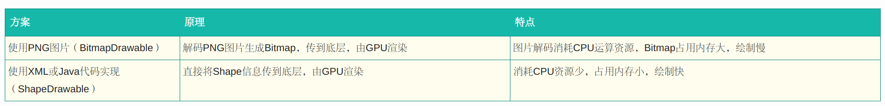

> https://source.android.com/devices/graphics

## Android 绘制模型

启用硬件加速后，Android 框架会采用新的绘制模型，该模型利用显示列表将您的应用渲染到屏幕上。

1. 硬件绘制的思想是将CPU不擅长的图形计算通过底层代码转换成GPU专用指令，让GPU完成绘制任务。

2. Android应用程序窗口UI首先是使用Skia图形库API来绘制在一块画布上，实际地是绘制在这块画布里面的一个**图形缓冲区**中，这个图形缓冲区最终会被交给SurfaceFlinger服务，而SurfaceFlinger服务再使用OpenGL图形库API来将这个图形缓冲区渲染到硬件帧缓冲区中。

3. 使用画笔 Skia / OpenGL 将内容绘制到 Surface 上，绘制的过程中如果使用 Open GL 渲染，那便是硬件加速，否则纯靠 CPU 绘制渲染栅格化的过程就叫软件绘制。对于硬件绘制，我们通过调用 OpenGL ES 接口利用 GPU 完成绘制。
4. Android 系统每间隔 16ms 发出一次 VSYNC 信号，触发对 UI 的渲染任务；为了能够实现流畅的画面，这就意味着应该始终让应用保持在 60 帧每秒，即每帧工作的准备时间仅有 16ms。
5. **硬件绘制还引入了一个 DisplayList 的概念，每个 View 内部都有一个 DisplayList，当某个 View 需要重绘时，将它标记为 Dirty**。当需要重绘时，仅仅只需要重绘一个 View 的 DisplayList，而不是像软件绘制那样需要向上递归。这样可以大大减少绘图的操作数量，因而提高了渲染效率。

### 基于软件的绘制模型

在软件绘制模型中，绘制视图分为以下两步：

1. 对层次结构进行无效化处理
2. 绘制层次结构

**每当应用需要更新其界面的一部分时，就会对内容已发生更改的所有视图调用 `invalidate()`（或其变体之一）。无效化消息会一直传播到视图层次结构上层，以计算需要重新绘制的屏幕区域（脏区域）。然后，Android 系统会绘制层次结构中与脏区域交互的所有视图。**遗憾的是，这种绘制模型具有以下两个缺点：

- 第一，每次绘制时该模型都需要执行大量代码。例如，如果您的应用对某个按钮调用 `invalidate()` 且该按钮位于另一个视图上方，那么即使该视图未发生更改，Android 系统仍会重新绘制该视图。
- 第二，该绘制模型会隐藏应用中的错误。由于 Android 系统会在视图与脏区域交互时重新绘制视图，因此系统可能会重新绘制内容发生更改的视图，即使未对其调用 `invalidate()` 也是如此。如果发生这种情况，您要依赖其他经过无效化处理的视图才能获得正确的行为。每次修改应用时，此行为都可能会发生更改。因此，每次修改会影响视图绘制代码的数据或状态后，您都要对自定义视图调用 `invalidate()`。

> **注意**：Android 视图会在其属性（例如 `TextView` 中的背景颜色或文本）发生更改时自动调用 `invalidate()`。

### 软件绘制刷新逻辑简介

实际阅读源码并实验，得出通常情况下的软件绘制刷新逻辑：

- 默认情况下，View的clipChildren属性为true，即每个View绘制区域不能超出其父View的范围。如果设置一个页面根布局的clipChildren属性为false，则子View可以超出父View的绘制区域。
- 当一个View触发invalidate，且没有播放动画、没有触发layout的情况下：
  - 对于全不透明的View，其自身会设置标志位`PFLAG_DIRTY`，其父View会设置标志位`PFLAG_DIRTY_OPAQUE`。在`draw(canvas)`方法中，只有这个View自身重绘。
  - 对于可能有透明区域的View，其自身和父View都会设置标志位`PFLAG_DIRTY`。
  - clipChildren为true时，脏区会被转换成ViewRoot中的Rect，刷新时层层向下判断，当View与脏区有重叠则重绘。如果一个View超出父View范围且与脏区重叠，但其父View不与脏区重叠，这个子View不会重绘。
  - clipChildren为false时，`ViewGroup.invalidateChildInParent()`中会把脏区扩大到自身整个区域，于是与这个区域重叠的所有View都会重绘。

### 硬件加速绘制模型

Android 系统仍会使用 `invalidate()` 和 `draw()` 请求屏幕更新和渲染视图，但会采用其他方式处理实际绘制过程。

1. Android 系统**不会立即执行绘制命令，而是将这些命令记录在显示列表中**，这些列表中包含视图层次结构绘制代码的输出。

2. 另一项优化是，Android 系统只需要记录和更新被 `invalidate()` 调用标记为脏视图的视图的显示列表。只需重新发出之前记录的显示列表，即可重新绘制未经过无效化处理的视图。

新绘制模型包含以下三个阶段：

1. 对层次结构进行无效化处理
2. 记录并更新显示列表
3. 绘制显示列表

使用此模型时，您无法依赖与脏区域交互的视图来执行其 `draw()` 方法。要确保 Android 系统会记录视图的显示列表，您必须调用 `invalidate()`。如果忘记执行此操作，则视图在发生更改后看起来仍然没有变化。

a. 使用显示列表还有助于改进动画性能，因为设置特定属性（例如 Alpha 或旋转）不需要对目标视图进行无效化处理（该操作是自动完成的）。

b. 这项优化还适用于具有显示列表的视图（如果应用经过硬件加速，则适用于所有视图）。

例如，假设有一个 `LinearLayout`，其中包含一个`ListView`（位于 `Button` 之上）。`LinearLayout` 的显示列表如下所示：

- DrawDisplayList(ListView)
- DrawDisplayList(Button)

假设您现在要更改 `ListView` 的不透明度。在对 `ListView` 调用 `setAlpha(0.5f)` 后，显示列表现在包含以下内容：

- SaveLayerAlpha(0.5)
- DrawDisplayList(ListView)
- Restore
- DrawDisplayList(Button)

系统没有执行 `ListView` 的复杂绘制代码，而是仅更新了更为简单的 `LinearLayout` 的显示列表。在未启用硬件加速的应用中，系统会再次执行列表及其父级的绘制代码。

## 了解硬件加速对App开发的意义

> https://tech.meituan.com/2017/01/19/hardware-accelerate.html

**充分利用硬件加速提高页面的性能。**以Android举例，实现一个圆角矩形按钮通常有两种方案：使用PNG图片；使用代码（XML/Java）实现。简单对比两种方案如下。

## DisplayList

> https://blog.csdn.net/luoshengyang/article/details/45943255

Display List的本质是一个缓冲区，它里面记录了即将要执行的绘制命令序列。这些绘制命令最终会转化为Open GL命令由GPU执行。这意味着我们在调用Canvas API绘制UI时，实际上只是将Canvas API调用及其参数记录在Display List中，然后等到下一个Vsync信号到来时，记录在Display List里面的绘制命令才会转化为Open GL命令由GPU执行。

与直接执行绘制命令相比，先将绘制命令记录在Display List中然后再执行有两个好处。

1. 第一个好处是在绘制窗口的下一帧时，若某一个视图的UI没有发生变化，那么就不必执行与它相关的Canvas API，即不用执行它的成员函数onDraw，而是直接复用上次构建的Display List即可。
2. 第二个好处是在绘制窗口的下一帧时，若某一个视图的UI发生了变化，但是只是一些简单属性发生了变化，例如位置和透明度等简单属性，那么也不必重建它的Display List，而是直接修改上次构建的Display List的相关属性即可，这样也可以省去执行它的成员函数onDraw。

Android应用程序窗口视图是树形结构的，因此它们的Display List是从根视图开始构建的，并且**子视图的Display List包含在父视图的Display List中。**

**除了TextureView和软件渲染的子视图之外，都具有Display List**，并且是通过一个称为Display List Renderer的对象进行构建的。TextureView不具有Display List，它们是通过一个称为Layer Renderer的对象以Open GL纹理的形式来绘制的，不过这个纹理也不是直接就进行渲染的，而是先记录在父视图的Display List中以后再进行渲染的。同样，**软件渲染的子视图也不具有Display List，它们先绘制在一个Bitmap上，然后这个Bitmap再记录在父视图的Display List中以后再进行渲染的。**

在Android 4.1及以上版本，**DisplayList支持属性，如果View的一些属性发生变化（比如Scale、Alpha、Translate），只需把属性更新给GPU，不需要生成新的DisplayList。**

