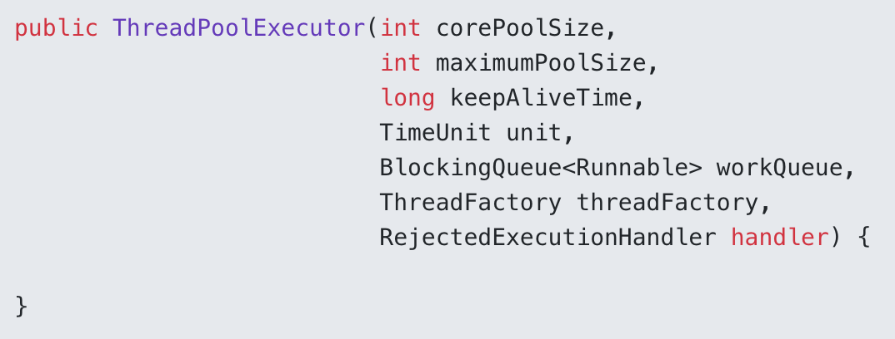
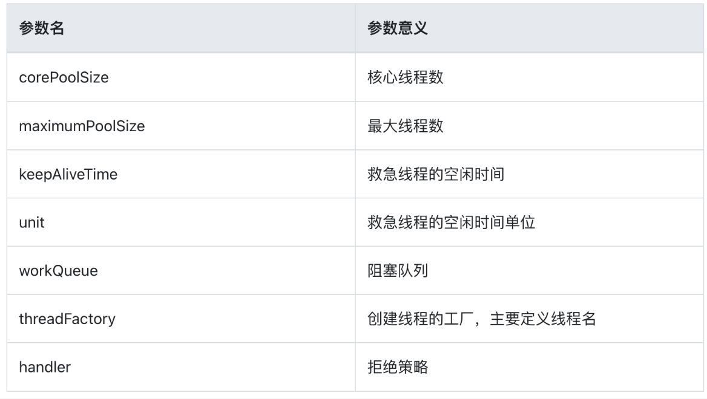

池化思想随处可见，Android中的使用例子都很简单VelocityTracker，OkHttp中的连接池，Handler的Message等，相关方法的命名基本一致，obtain和recycle。

# 线程池

线程的重复利用，降低了线程的创建和销毁的资源消耗。

池化设计上要考虑的问题有：

1. 队列大小（池大小）
2. 调度策略或优先策略或进出策略
3. 拒绝策略｜错误处理
4. 复用重置｜状态重置

java.util.concurrent下的包是个很不错线程池例子。

当调用 execute() 方法添加一个任务时，线程池会做如下判断：

- 如果正在运行的线程数量小于 corePoolSize，那么马上创建线程运行这个任务
- 如果正在运行的线程数量大于或等于 corePoolSize，那么将这个任务放入队列；
- 如果这时候队列满了，而且正在运行的线程数量小于 maximumPoolSize，那么还是要创建非核心线程立刻运行这个任务；
- 如果队列满了，而且正在运行的线程数量大于或等于 maximumPoolSize，那么线程池会拒绝这个任务，调用RejectedExecutionHandler 来对被拒绝掉的任务进行处理。
- 当一个线程完成任务时，它会从阻塞队列中来尝试获取下一个任务来执行，如果没有获取到，那么线程就会进入阻塞状态。
- 当一个线程超过一定的时间（keepAliveTime）时没有获取到任务的时候，线程池会判断，如果当前运行的线程数大于 corePoolSize，那么这个线程就被停掉，退出。所以线程池的所有任务完成后，它最终会收缩到 corePoolSize 的大小。
- 如果设置了允许核心线程数超时，那么核心线程也会退出，可以通过方法allowCoreThreadTimeOut来让核心线程超时退出。

## **拒绝策略**

jdk自带的有四种

- AbortPolicy：丢弃任务，抛出运行时异常。
- CallerRunsPolicy：有提交任务的线程来执行任务。
- DiscardPolicy：丢弃这个任务，但是不抛异常
- DiscardOldestPolicy：从队列中剔除最先进入队列的任务，然后再次提交任务

## **shutdownNow() 和 shutdown()** 

 shutdownNow() 和 shutdown() 都是用来终止线程池的，它们的区别是，使用 shutdown() 程序不会报错，也不会立即终止线程，它会等待线程池中的缓存任务执行完之后再退出，执行了 shutdown() 之后就不能给线程池添加新任务了；shutdownNow() 会试图立马停止任务，线程中的任务不会再执行，也无法添加新的任务。

当然我们可以自己实现 RejectedExecutionHandler 接口来处理被拒绝的任务。

# 数据库连接池

频繁创建连接影响性能。
# Java 内存池|系统内存
频繁申请影响利用率（内存碎片）。
# 对象池
频繁生成内存抖动。

